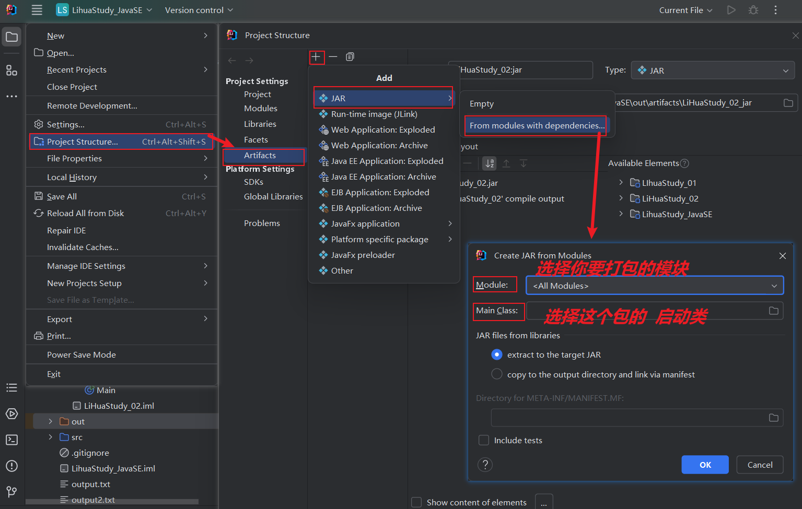
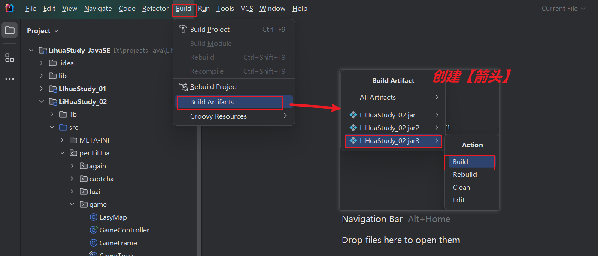
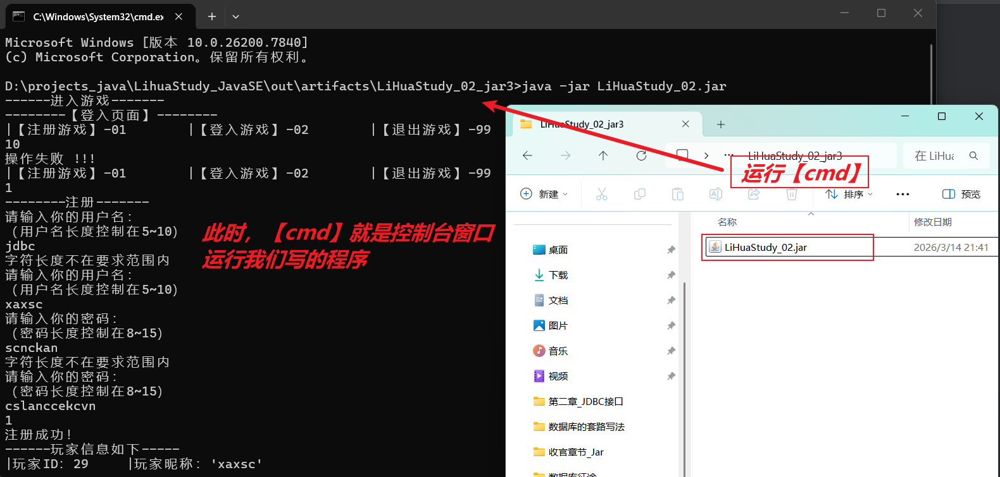
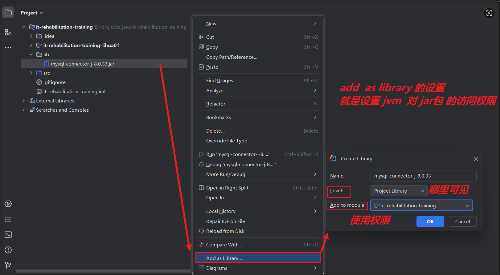

+++
date = '2025-12-23T19:04:18+08:00'
draft = false
title = '收官章_jar'
weight = 1
description = '笔记性质的文章-学习打包相关的知识'
+++
**引言：**     
在上一章中我们已经成功学习完**数据库**的相关知识了，     
结合之前学习的**javase**,     
我们成功让**程序连接数据库**，并创建了一个游戏项目——打地鼠（**数据库**存储玩家账户信息，**代码**执行游戏）

那我们接下来就是要学习**打包项目**，这样就可以把我们写的东西，给到别人手里

在打包之前我们先要讨论一些程序相关的问题     
* **数据的复用性：**     
因为在我们写代码的时候，有很多**数值**是**在不同位置重复出现**的，所以我们把他们存放在一个**变量**里      
有很多**方法**是一样的，所以我们把他们写成一个**方法**，反复的调用它          
像这样的数据，因为我们想要微调或者外界因素发生改变的时候，是**牵一发而动全身**的，所以我们需要实现**改变某一处，整个程序里面这个数据出现的地方都会发生向相应的改变**的效果     

* **办法一：工具类**
这些**方法**和**变量**我们放在一起就构成了一个**工具类：**   
```java
    public final class Test{
        // 不会被继承
        private Test(){
            // 私有化构造器
            // 工具类不需要实例化
        }
        public static final  XXX_YYY = 100;
        // 静态常量
        public static void xxxYyy() {
        // 静态方法
        }    
    }
```
**工具类**提升代码复用性的方法还是在整个程序的内部进行的        
所以我们就用来存储一些**程序内部的数据**，    
这些数据我们一般是不会进行改动的，改动就相当于是微调项目了     

那像我们之前的项目中**Class.forName()**中连接数据库的**参数**，   
而是会**因为我们连接的数据库的不同**而发生改变的数据    
像这样会因为**外部因素**而**频繁去改变**的数据，我们就会用到**配置文件**，配置文件为他人提供了一个**在程序外部改变程序内数据**的办法，让我们的程序更加通用、灵活    
* **办法二：配置文件**     
在项目的目录下新建文件夹`config`  
这里面放的文件必须是用`.properties`后缀结尾（也就是**配置文件**）

```properties  
    key = values
    <!-- 用这个结构存储数据 -->

    url = jdbc:mysql://127.0.0.1:3306/数据库 
    driver = com.mysql.cj.jdbc.Driver
    <!-- 字符串不需要使用`""`引号 -->
```
**配置文件**要与 **工具类** 一起使用    

配置文件可以**在程序外面**修改数据，但是数据想要生效还是要进到程序里面    
所以我们用**工具类**读取配置文件，读取之后存储在工具类中就能给程序使用了       
这里要讨论一下，因为在程序执行之前这个数据就要明确，所以读取必须是在**类被创建**的时候就要发生    
所以我们用到**静态代码块：**    
```java
    public final class Test{
        static String driver;
        // 工具类创建【静态属性】

        static{
            // 在这里面的执行语句，是在“类被创建的时候”就执行的
    // 所以我们在【静态代码块】里面执行我们“读取配置文件”的操作

            Properties prop = new Properties();
            // 创建配置文件Properties对象
            prop.load(new FileInputStream("config/具体的配置文件"));
            // 导入【输入流】对象，也就是拿到配置文件的数据    
            driver = prop.getProperty("键名");
            // 依赖【键名】拿到【值】，并存入工具类的属性
        }

        private Test(){
            // 构造器里面的语句，是在“对象被创建的时候”就执行的
        }


        public static final  XXX_YYY = 100;
        // 静态常量
        public static void xxxYyy() {
        // 静态方法
        }    
// 在【静态代码块】里面执行的语句，如果要处理异常，你只能用异常的捕获，因为跟main方法一样，再往上抛就是抛给jvm虚拟机
    }
```
* 在最后，一定要确保**配置文件**和**项目jar包**在同一个目录下，其他人运行**jar包**的时候**配置文件**才能生效

***

**项目打包**，项目的打包，就是**文件归档**，    
在windows操作系统中，我们的**文件夹**想要传输到**第三方的软件**，例如微信、QQ上，那么先要进行**zip压缩**，这个过程就是把**文件夹**里面的文件进行归档，**第三方软件**拿到这个压缩包之后，进行**解压**才能使用里面的文件    

* **jar打包，jar包的导入**     
这两个操作就是**java文件**专门的**zip压缩**和**idea解压**操作    
整个过程是实现**idea**与**第三方，外界**之间的**java文件**互通   

* **jar打包：**    
**创建 箭头【Artifacts】:**
    

**搭建【箭头】：**   


打包好的**文件(.jar后缀结尾)**，会被存储到`项目的【out】目录下的【artifacts】目录`中，你可以在里面找到你创建的**jar包**    
* **jar打包的文件运行：**     
如果你的电脑已经在**path环境**中配置好了jdk,那你就能在**电脑的任意位置**运行**java文件**    
所以，比如你现在拿到了一个**jar包**，   
你就可以在**jar包当前的目录下**打开`cmd`,   
用`java -jar 【jar包的文件名】` -> 运行这个jar包，其实就是运行里面的**启动类**      
这里是使用了**JDK**里面的**java.exe 执行工具** 和 **jar.exe 打包工具**   


**项目打包**就是把idea中写的java文件**给出去**   
那么**导入jar包**就是把别人写好的jar包**拿进idea里面来**  

* **导入jar包：**   


先在**工程目录/模块目录**创建一个**lib文件夹**，`lib文件夹`就是用来放**第三方库的**    
我们把**别人写的jar包**放到`lib目录`下，

`右键jar包` + `点击add as library`     
如果你把**jar包**放到工程的lib中，你在`add to module `的设置就填写工程 -> 工程下所有模块都能用这个**jar包**      
如果你把**jar包**放到某个模块的lib中，你在`add to module`设置这个模块 -> 这有这个模块能用这个**jar包**    


