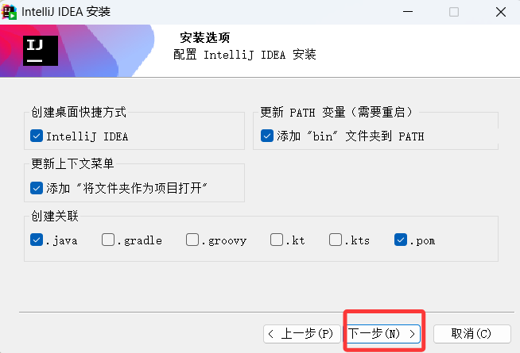
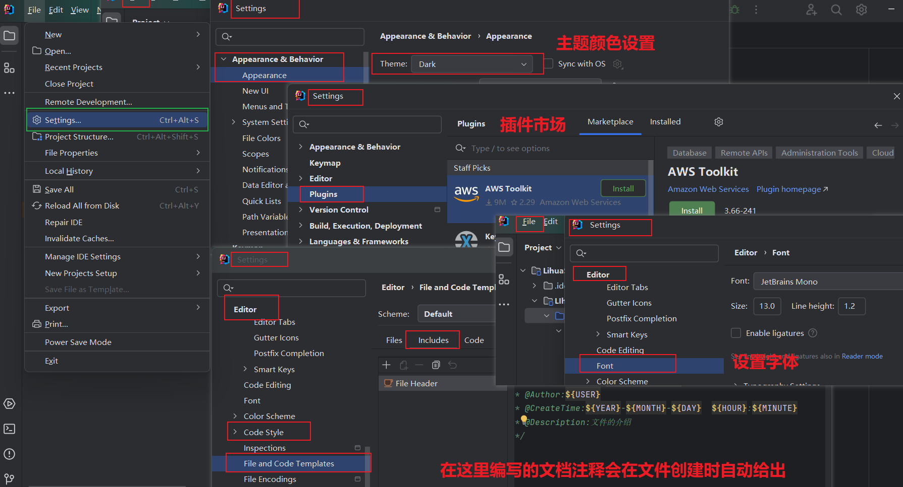

+++
date = '2025-12-03T00:47:22+08:00'
draft = false
weight = 2
title = '第一章_(附录)_idea使用规范'
description = 'idea,一种集成开发工具，，学习安装，了解功能并使用'
+++

## 什么是idea？ 
* IDE,是指集成开发环境，所有都有对应的IDE
* IDEA，是一种兼容多种语言，极致支持java的主流IDE 

## 安装<sup>破解版的idea</sup> 
1. 下载并安装idea



## 相关属性配置
* idea的支结构：
-工程- -模板- -包- -class文件-

*包的命名* ：com.xxx.技术<sup>公司域名的倒写</sup>
*class类文件* ：书写格式如下

    > * 导入包的语法：  
    1. `import java.util.* `--> 把整个包的所有类导入  
    2. `import java.util.具体的类`--> 把具体的类导入
    * **只有这样才能使用包中的类**


* 设置调整：  
1. 主题相关：idea的页面呈现
2. 字体
3. 文档注释：对当前文件的解释
4. 插件


5. 自动导包配置:使用类的方法时，自动导入对应的包。


*** 
#### 语法简写
`new 类名称(参数).var + 回车` -> 快捷键创建对象  
`字符串/数值.sout + 回车` -> 快捷打印

***
#### 快捷键
`ctrl + shift + /` --> 实现多行注释  
`ctrl + d` --> 实现向下复制  
`ctrl + 点击` --> 查看源代码  
`ctrl + o`--> 快速构建子类的继承
`insert(fn + delete触法) + alt`/`右键 + Generate`-->快速构建【类】的基本结构

*** 
#### java提供的API

* **java.lang包**
> 基础类,不用import 导入,JVM会自己加载  --> 聚焦对象模型、字符串处理、线程管理的功能
* **Math类**
```java
    功能，实现简单的数学需求
    -----------------
    # 不需要创建对象，类的方法都是static静态的，`类名.方法()`调用
    -----------------
    Math.abs(数值类型 num) --> 取绝对值，作为返回值<对应类型>
    Math.max(数值类型 num1，数值类型 num2)/Math.max() -> 
    取较大数值(会自动转换类型)，作为返回值<对应类型>
    Math.pow(double num底数，double num指数) -> 取幂运算，作为返回值<double>
    Math.sqrt(double num) -> 取开平方的数，作为返回值<double>
    Math.ceil(double num)/Math.floor() -> 取向上取整,作为返回值<double>
    Math.round(float num)/Math.round(double num) -> 取四舍五入，
    作为返回值<对应float的返回int>/<对应double的返回long>
    Math.random() -> 生成随机数[0.0,1.0)之间的数，作为返回值<double>
```


* **java.util包**
> 需要手动导入  --> 聚焦数组操作、输入处理、集合存储的功能
* **Scanner类**  
```java
    功能：扫描输入流中的数据
    -----------------
    # 需要创建对象
    `new Scanner(System.in).var`->简写创建对象`System.in构造`扫描控制台的键盘输入 
    ----------------
    * 堵塞原理 ：只要执行到Scanner类的方法,就会先暂停程序的执行，
    等待数据的到位后才能继续运行程序，

    # 读取型方法
    `对象名.next()` --> 读取输入流中的数据<String>并把数据拿走，作为返回值<String>
    `对象名.nextInt()` --> 读取的类型可规定，类型不符合会直接异常
    所以可以用 判断型方法，实现异常的处理

    # 判断型方法
    `对象.hasNextInt()` --> 仅读取的类型，判断后返回<boolean>，并不会消费数据，
    如果不用 读取方法消耗，输入流的数据会一直残余到本次程序运行结束。
```
* **Arrays类**
```java
    功能：针对数组的方法，处理数组
    -----------------
    # 所以方法都是static静态方法，不需要创建方法，`类名称.方法()`调用
    -----------------
    Arrays.toString(数组) --> 返回数组元素的<字符串>
    Arrays.toString(数组) --> 无论一维、二维数组，返回数组元素<字符串>
    Arrays.sort(数组) --> 升序数组处理，<无返回值>
```
* **Random类**
```java
    功能：专门生成随机数
    --------------
    * 伪随机数，种子生成原理
    由于随机数是依据种子计算生成的，所以当种子一致时，用相同的顺序，
    使用相同的方法获取的随机数，是一样的

    # 需要创建对象
    `Random rd = new Random()` -> 无参构造器创建对象-以系统时间为种子
    -保证对象的种子唯一性
    `Random rd = new Random(long seed)` -> 有参构造器-以参数为种子
    ----------------------
    * 求取指定范围的随机数
    想要 a~b 就先假定 [a,b]- a,找到重要节点[0,b] 
    -> 随机数方法构建出[0,b+1),再`[0,b+1)+a`运算即可

    rd.nextInt() -> 生成随机int数，作为返回值<int>
    rd.nextBoolean() -> 生成随机boolean值，作为返回值<boolean>
    rd.nextFloat() -> 生成随机[0.0F,1.0F),作为返回值<float>
    rd.nextDouble() == Math.random() 
    rd.nextInt(int bound) -> 取[0,bound)之间的随机数，作为返回值<int>
```
