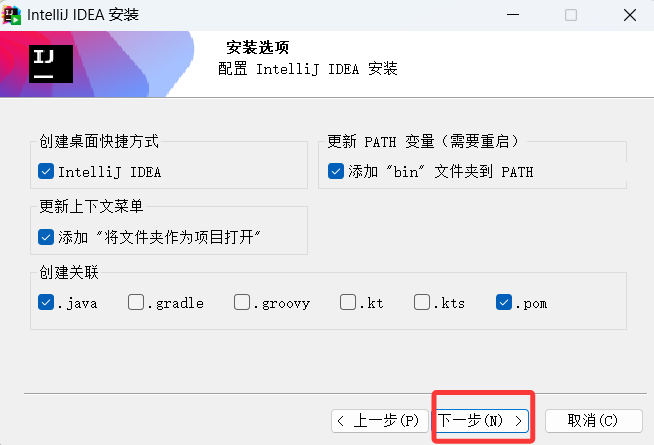
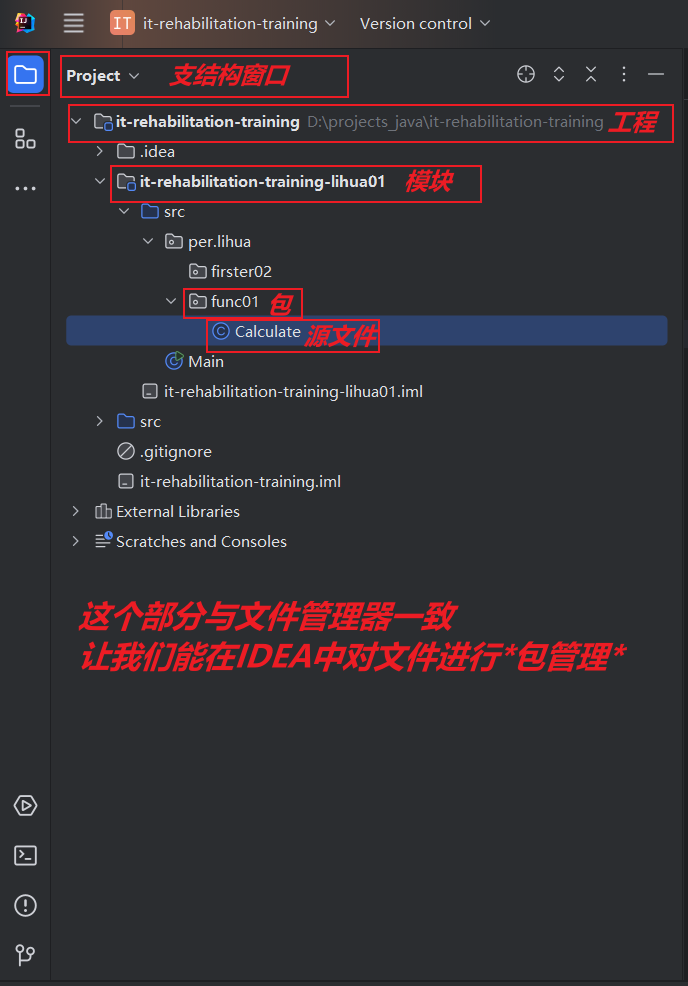
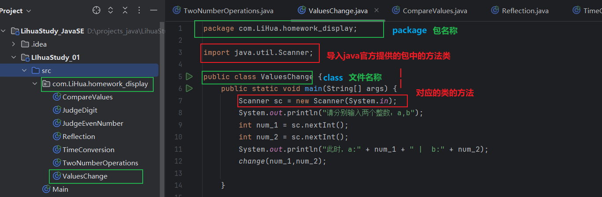
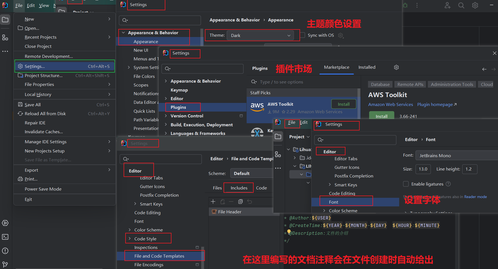
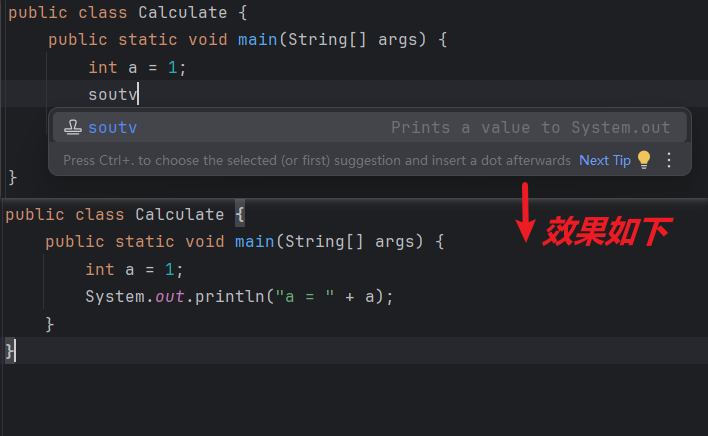

+++
date = '2025-12-03T00:47:22+08:00'
draft = false
weight = -48
title = '第一章_(附录)_idea使用规范'
description = '工具性质文章-安装教程 + 使用idea工具的方法'
+++

**引言：**   

在上一章中，我们成功**安装JDK并配置了环境变量**，此时，我们已经能在电脑上自由的编写java程序了。   
接下来我们将学习使用——编程语言开发工具**IDEA**   
* 当我们学习一个软件工具时，我们要分为**安装和初始化配置**和**使用该软件**两大部分学习


## 什么是idea？ 
IDE,是指**集成开发环境**  
    所有编程语言都有对应的IDE，它把我们在编写该语言时所可能需要的功能都整合到一个软件中方便我们使用

**IDEA**，是一种兼容多种语言，极致支持java的主流IDE 

## 安装<sup>破解版的idea</sup> 
1. 下载并安装idea



***
## 使用该软件
**idea的支结构：**   
编写程序时，**文件**就是程序的载体，idea的支结构 对应的 就是在电脑的文件管理器中创建文件的过程    
-工程- -模板- -包- -源文件-   
让我们从创建**工程开始：** 

在创建**工程**时注意：  
* 工程的名称用全小写  
* 单词之间用`-`连接   

此时，工程创建成功！  
我们在一个idea窗口下只打开一个工程，所以工程就是**支结构**的最大单位  
工程目录下的创建规范：

**模块**   
* 右键**工程**  -> 点击**New** -> 选择**Module**  
* 名称全小写、单词之间用`-`连接  
* 命名时用工程名开头：  
**工程名**-**Module名**   

**包**  
* 右键**模块的src文件夹** -> 点击**New** -> 选择**Package**   
* 名称全小写、单词之间用`.`隔开  
`.`会分隔目录层级 例如xxx.yyy.zzz是创建了三个文件夹，彼此之间是包含关系   
* xxx第一层是**com/per/org**表示这个包的开发人员，公司、个人、开源组织  
yyy第二层是开发人员名称     
zzz第三层是包的功能

**源文件**  
* 右键**包** -> 点击**New** -> 选择**Java Class**
* 名称用**驼峰命名法** 例如XxxYyy   

**文件**是编程语言，也就是我代码的载体所以我们说源文件是最小的**支结构**单位  
我们后面的学习都将聚焦在源文件的语法规则上   
源文件的结构：   

**文件**就是**类**，**类**的英文是**class**，我们编写的源文件就是要转译成**class类文件**   
文件的**全称**，也就是类的**全称**，是 **类所在的包** . **类名**

**导入包的语法：**  
* import 包的名称.* --> 把整个包的所有类导入  
* import 包的名称.具体的类--> 把具体的类导入  

导入包之后就能在**当前的类** 中使用 **导入包中的类**


**idea的配置调整：**   
IDEA的功能非常多，包括自动生成代码 、 快捷键 、 插件市场   
全部集中在菜单一栏，大部分在 **设置（alt + ctrl + s）** 中寻找  
想弄什么自己问AI，功能只要你想不到，没有做不到   


自动导包配置:使用类的方法时，自动导入对应的包。免去手动操作


**IDEA的语法简写：**   
`new 类名称(参数).var + 回车` -> 快捷键创建对象    
`new 类名称<>(参数).var + 回车` ->快捷创建对象，对象有泛型    
```java
    ArrayList<Object> xxxYyy = new ArrayList<>();
```
`集合对象.iterator().var` -> 简写创建迭代器对象     
`对象.成员方法().var` -> 简写变量存储**返回值**   
```java
    Iterator<Object> it = al.iterator(); 
```

`psvm + 回车` -> 快捷构建方法声明  

`数组名/集合名.for` --> 增强for循环的简写
`数组名.fori` --> 遍历数组的简写     
`100.fori` --> 简写++类型的for循环
```java
    for (int i = 0; i < 100; i++) {
        执行语句 ；
    }
```   
`数值.forr` ->  是- -型的for循环的简写    

`字符串/数值.sout + 回车` -> 快捷打印  
```java
    System.out.println();
    // 在控制台打印出字符串
    // 参数可以是数字（包括计算式）、字符（+可以拼接）
    System.out.println(10+90);
    System.out.println("chen"+"yuxuan");
    // `\`号表示转义`\n`换行`\t`单行的缩进，多行的对齐
    System.out.println("123\t987\n1\t3");
    // 打印的效果是：
    123  987
    1    3
    //System.out.println();是结束后会换行，光标来到下一行
      System.out.print();
    //System.out.print();是结束后不换行，光标来到结尾    
```
`soutv + 回车` -> 快捷打印上一行变量的值


**功能小tips：**   
`//注释的地方 加入 TODO` -> 待办的任务标记  
`菜单 -> view -> toolWindows -> TODO` -> 查看待办


**快捷键:**  
`ctrl + shift + /` --> 实现多行注释

`ctrl + d` --> 实现向下复制  

`ctrl + 点击` --> 查看源代码 

`ctrl + o`--> 快速构建子类的继承  
`insert(fn + delete触发) + alt`/`右键鼠标 + Generate`-->快速构建【类】的基本结构  

`选中目标+ctrl + alt + t` --> 快速构建各种作用域  
如【try-catch】结构、【do-while】结构       
`选中编译时异常 + alt + enter(也就是回车)`  --> 对编译时异常，采用**在方法声明throws**，   
对自己代码十分自信，冷暴力了系统的提醒

*** 
**jre中的核心类库**   

**java.lang包**   
存放一些基础类 , **不用import语法 导入** , JVM会自己加载    
聚焦对象模型、字符串处理、线程管理的功能
* **Math类**   
实现简单的数学需求  
**不需要创建对象**，类的方法都是static静态的，`类名.方法()`调用
    * **Math.abs(数值类型 num)**  
    取绝对值，作为返回值<对应类型>
    * **Math.max(数值类型 num1，数值类型 num2) /   
    Math.min(数值类型 num1，数值类型 num2)**   
    取较 大 / 小 的数值(会自动转换类型)，作为返回值<对应类型>
    * **Math.pow(double num底数，double num指数)**   
    取幂运算，作为返回值<double>
    * **Math.sqrt(double num)**   
    取开平方的数，作为返回值<double>
    * **Math.ceil(double num)/  
    Math.floor()**   
    取向 上 / 下 取整,作为返回值<double>
    * **Math.round(float num)/  
    Math.round(double num)**   
    取四舍五入，作为返回值<对应float的返回int>/<对应double的返回long>
    * **Math.random()**   
    生成随机数[0.0,1.0)之间的小数，作为返回值<double>

***

**java.util包**  
存放的类**需要import导入语法**   
聚焦数组操作、输入处理、集合存储的功能
* **Scanner类**    
扫描**输入流**中的数据  
**需要创建对象** `new Scanner(System.in).var` 简写创建对象   
`System.in`参数构造，确认输入流：扫描控制台的键盘输入 
    * 堵塞原理 ：只要执行到Scanner类的方法,就会**先暂停程序的执行**，
    等待数据的到位后才能继续运行程序，

    **读取型方法**   
    `对象名.next()` --> 读取输入流中的数据<String>并把数据拿走，作为返回值<String>   
    `对象名.nextInt()` --> 读取的类型可规定，类型不符合会直接异常
    所以可以用 **判断型方法** 实现异常的处理

    **判断型方法**  
    `对象.hasNextInt()` --> 仅读取的类型，判断后返回<boolean>，并不会消费数据，
    如果不用 **读取方法** 消耗，输入流的数据会一直残余到本次程序运行结束。


* **Arrays类**   
针对数组的方法，处理数组   
**方法都是static静态方法，不需要创建方法**，`类名称.方法()`调用
 
    Arrays.toString(数组) --> 返回数组元素构成的<字符串>，就是解决了数组元素无法直接打印的问题      
    Arrays.deepToString(数组) --> 无论一维、二维数组，返回数组元素<字符串>    
    Arrays.sort(数组) --> 升序数组处理，<无返回值>，效果是改变**作为参数的数组**


* **Random类**   
专门生成随机数     
    * 伪随机数，种子生成原理，**计算机生成的随机数都是伪随机数**   
    由于随机数是依据种子计算生成的，所以当种子一致时，使用相同的方法获取的下一位随机数，是一样的。例如，种子是A ， 那下一个生成的随机数就是**固定函数f(X)代入A得到的数字**

    **需要创建对象**

    `Random rd = new Random()` -> 无参构造器创建对象-以 **时间戳** 为种子，保证了对象的种子唯一性    
    `Random rd = new Random(long seed)` -> 有参构造器-以参数为种子    
    `rd.nextInt()` -> 生成随机int数，作为返回值<int>    
    `rd.nextBoolean()` -> 生成随机boolean值，作为返回值<boolean>   
    `rd.nextFloat()` -> 生成随机[0.0F,1.0F),作为返回值<float>   
    `rd.nextDouble()` == `Math.random()`    
    `rd.nextInt(int bound)` -> 取[0,bound)之间的随机数，作为返回值<int>