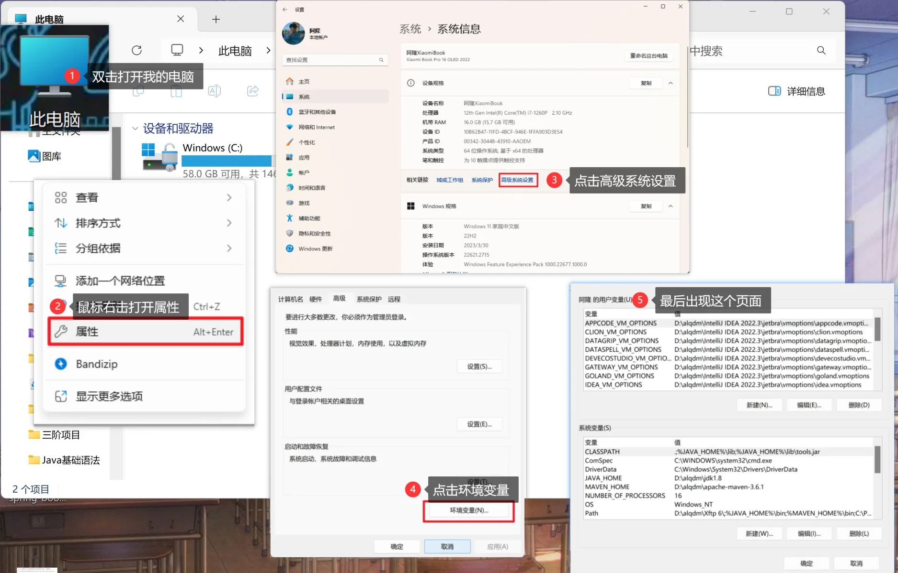
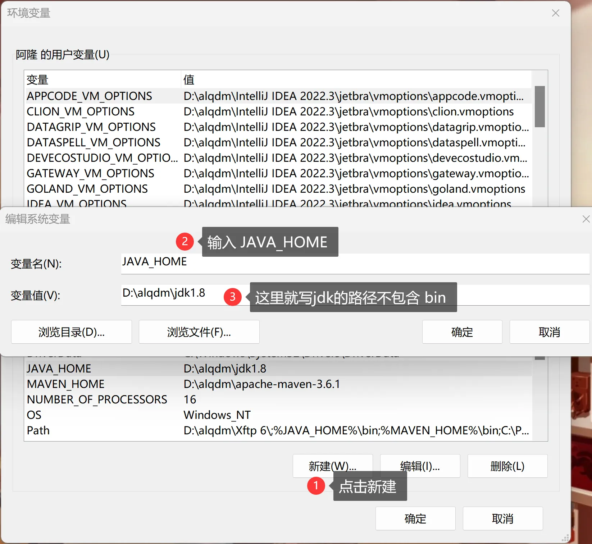
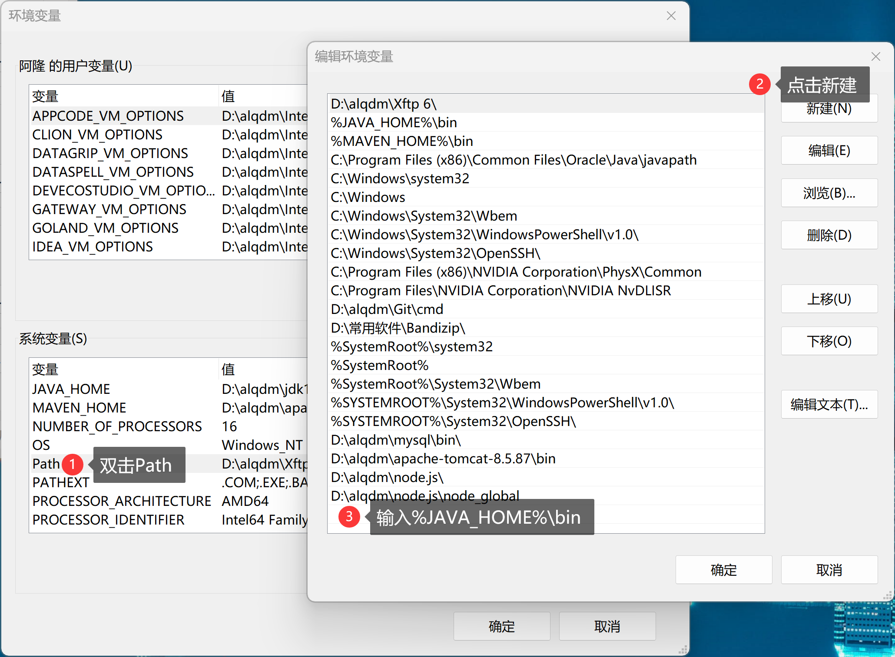
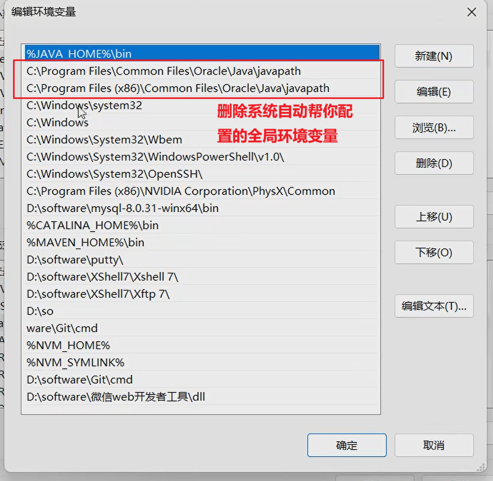

+++
date = '2025-12-01T19:23:54+08:00'
draft = false
weight = 1
title = '第一章 安装JDK并配置环境'
+++

## 核心概念
### 什么是JDK？
* JDK，是java后端语言的开发工具包  
    > 1. java.c编译工具 --> 实现把 *源文件* (.java)变成 *类文件* (.class),  
    **就是让编程语言能被计算机JVM,即java虚拟机 读懂的语言** |   
    JVM虚拟机 解析 *类文件* ，编译成 *操作系统* 能读懂的指令，  
    java执行工具 --> 执行指令

    > 2. JRE,是java的运行环境   
        >>  JVM虚拟机  
        >>  java提供的方法：  
        -java核心类库实现类   
        -API接口

### 为什么配置环境变量？
* 告诉 *操作系统* 可执行程序在哪里 --> 所以 *环境变量* 指向JDK的bin目录存放java、javac  
**配置全局环境变量 --> 电脑任意目录下能执行java相关命令**

## 安装操作
1. 安装JDK  
2. 配置全局环境变量：
            
            
            
            

* JAVA_HOME变量--> 告诉 *操作系统* JDK 在哪里
* Path变量--> 告诉 *操作系统* bin文件夹 在哪里

3. 在操作系统用 java --version 指令，能正确返回--> 说明配置正确