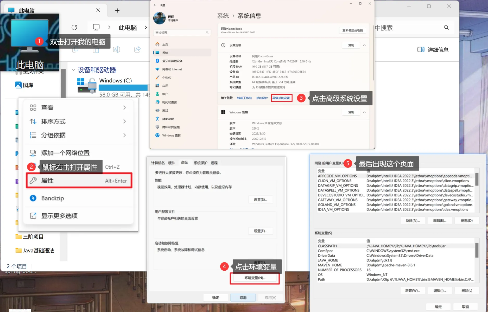
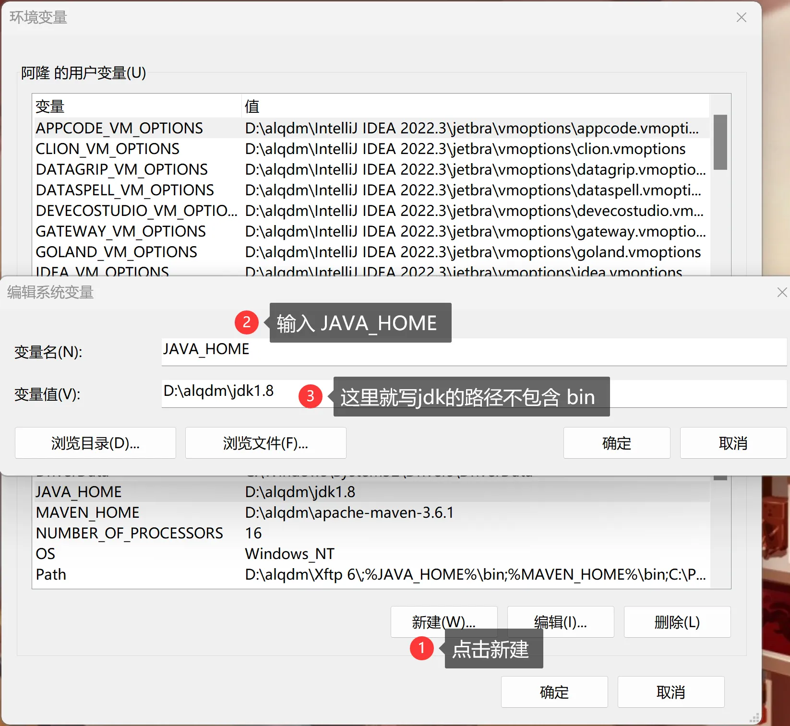
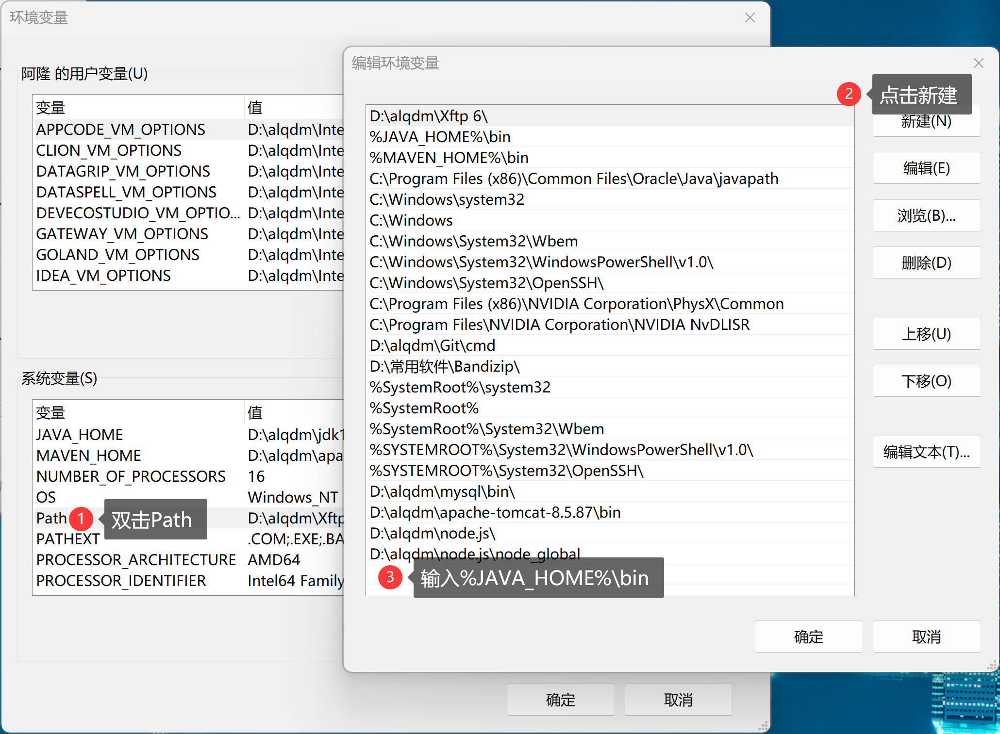
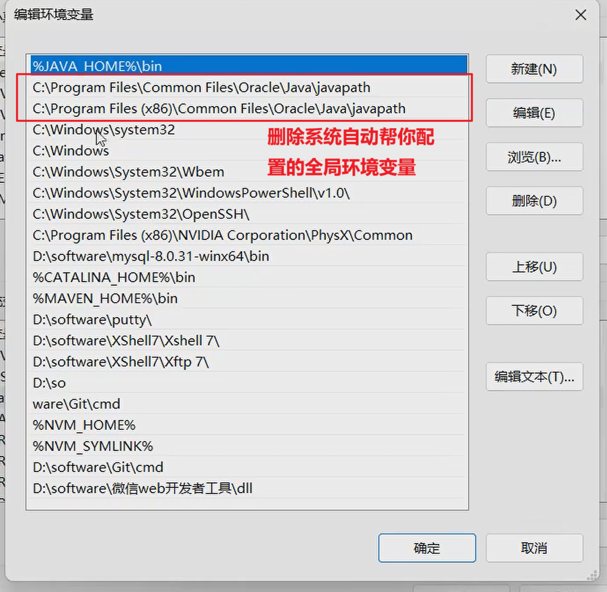

+++
date = '2025-12-01T19:23:54+08:00'
draft = false
weight = 1
title = '第一章 安装JDK并配置环境'
description = '工具性质文章-安装教程，是开启技术学习的前置必要条件'
+++
**引言：**     
    **java** , 一种后端语言 。  
    **JDK** ,  java开发工具包 。这个包中包含了( java开发工具集 **+** 完整的jre )  
    那什么是 **java开发工具集** 呢？  
    ---顾名思义，就是编写 java语言 所需的工具，具体工具**如下：**  

1. **javac.exe** , 编译工具 。可以把 源文件(.java) 变成 类文件(.class),这个过程就是实现 **把程序员编写的文件，人能看懂的java语言 变成 java虚拟机能看懂的语言**
2. **java.exe** , 运行启动工具。初始化并启动 jvm虚拟机实例 。
3. **其他辅助工具** ， 包括 **jar.exe（打包工具）**、**javadoc.exe(文档生成工具)**、**jdb.exe(调试工具)**  

好！那什么又是 **jre** 呢？  
---它是 **java运行时环境** 。就是指编写java时所需要的前置条件，具体条件**如下：**  

1. **jvm虚拟机** ，就是 **java虚拟机** 。作用是运行并管理 class类文件。它的工作机制暂不考虑学习，当代码在虚拟机层面出现报错时，我们再考虑学习它。我们可以在不同的 **操作系统（OS）** 上安装不同的 **jvm虚拟机** ，这样就实现了 **class文件中的代码 跨平台运行的保证** 。
2. **java核心类库** ， 就是我们在写代码时可以调用的其他人已经帮我们写好的、具有相应功能的 **类** 。而规范这些类的模板就是 **javase api**，所以这些类都是按照java官方提供的api规范创建的。

所以**写代码的整个过程**究竟是怎么一回事呢？   
【->】程序员编写源文件(.java)  
【->】执行JDK包中的 javac文件 编译 源文件(.java),此时**源文件 变成 类文件(.class)**  
【->】执行JDK包中的 java文件 初始化并启动一个jvm虚拟机实  
【->】后续所用对 (.class)类文件 进行加载、解析、执行的相关操作都是用jvm虚拟机完成。此时，你的代码就在虚拟机上跑起来了！
* 对应的命令行操作：  
    创建文件 XxxYyy.java  
    打开Windows的命令行窗口cmd ,找到该文件所在的目录  
    **命令行 javac XxxYyy.java** -> 在当前目录下生成对应的 XxxYyy.class 文件  
    **命令行 java XxxYyy** -> 类文件 在jvm虚拟机上跑起来了，代码成功运行

### 为什么配置环境变量？
告诉 **操作系统** 和 **第三方软件** 我的文件在电脑的哪里   
只要向 **环境变量** 提供文件对应的安装路径就行   
*   **path 环境变量** ，全局环境变量。   
    当你把文件（可执行的文件）配置到这个环境变量上。此时，在命令行窗口（定位到电脑的任意目录下）写上 文件名称 ，程序都能被执行。  

所以我们把 **javac.exe** 和 **java.exe** 文件配置到 path 上，为了让在命令行窗口（定位到电脑的任意目录下） javac/java 都能被执行。

* **JAVA_HOME**   
    把JDK的地址配置到这个变量下，让第三方应用软件能找到我们的 JDK

## 安装操作windows系统（实操）
1. 拿到JDK的安装包  
2. 配置全局环境变量：
            
            
            
            
    * 【JAVA_HOME变量】--> 告诉 *操作系统* JDK 在哪里
    * 【Path变量】--> 告诉 *操作系统* bin文件夹 在哪里

3. 在操作系统的指令窗口`cmd`用 java --version 指令，能正确返回--> 说明配置正确

**随手记：**  

**sun公司**在设计java语言时，把它在内容上划分成三个部分（se/ee/me）,的目就是为了让java适用于不同的场景。我们现在所学习的**javase** ，包含了所有java入门的内容。

**文件的后缀**一般代表了文件的性质。(.exe)表示可执行文件，  
    exe 是 **executable** 的缩写

**文件夹的命名**是有潜规则的。   
    **bin** 是 binary 二进制的缩写，一般用来存放**可执行文件**，当我们双击图标打开程序的这个过程，执行的是程序启动文件，而这个启动文件本身就是一种可执行文件     
    **lib** 是 library 库的缩写，一般用于存放从别人那里获取的文件，例如第三方库    
    **conf / etc** 分别是 confic 配置的缩写 以及 etcetera 杂类的缩写，一般存放的是配置文件   
    **src** 是 source 源头的缩写，一般存放的是程序开源的源代码    
    **doc** 是 document 文件的缩写，一般存放的是官方文档或者API文档等说明书   
    **logs** 一般存放程序的运行日志、报错日志