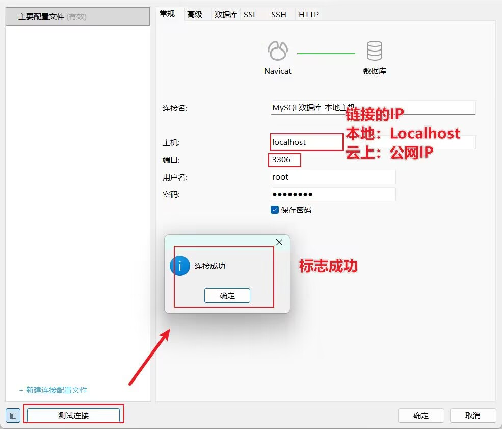

+++
date = '2025-12-20T15:13:17+08:00'
draft = false
weight = 71
title = '第一章_安装MySQL数据库+可视化工具'
description = '工具性质的文章-安装MySQL数据库，可视化操作工具并学习使用'
+++
前言：可视化工具操作数据库，主打方便，我们只用他来处理初始化方法的创建，关于数据的处理，主要还是用SQL语句实现

#### 安装MySQL数据库windows版本
* 数据库，是一种存储数据的方法，是永久的存储

* **数据库结构：**   
    -数据库  
    -表：  
    * 字段  
    * 数据条 —— 我自创的，一条数据为单位，称为“数据条”

***
## 使用可视化工具——Navicat
* 使用前提：  
    系统防火墙、服务器安全组端口放行，才能链接
    
    * 成功建立联系 -> 可视化操作数据库

* 操作：  
    我们主要使用可视化工具创建数据库的“库 - 表 - 字段等【表设计】”    
    1. `右键链接 + 新建数据库` -> <链接级操作>新建数据库
        * 默认情况下设置如下：
        * 名称：全小写 `_`连接单词
        * 字符集：utf8mb4
        * 排序规则： （第一个）
    2. `右键数据库 + 打开数据库` -> 数据库里的结构 - 表   
        `点击数据库 + 点击查询 + 建立查询` -> <数据库级操作>建立[查询](#数据库级操作查询)，在查询中写入SQL语句
    3. `右键表 + 新建` -> 创建表，设计【字段】创建  
        * 字段设计如下：
        > **字段名 | 数据类型 | 长度 | 约束**
        > * 添加字段用【上下键】   
        > * 字段名：全小写
        * 数据类型:  
        数值类型
          
        字符串类型
         
        > char -> 定长的  |  varchar -> 动态长度 

        时间类型
        
        > 时间类型数据的自动填充设计：
        > 1. `点时间类字段 + 默认处输入CURRENT_TIMESTAMP`-> 默认为当前的时间戳  
        > 2. `点时间类字段 + 默认处输入CURRENT_TIMESTAMP + 更新时间戳勾选`-> 实现修改数据时默认时间戳会更新
        > * 时间类型字段一般就两种，create_time ,update_time  
        * 约束：  
        对数据的限制  
            1. `不是null + 勾选` -> 数据不能是空值
            2. `键 + 勾选` -> 【主键】：数据非空，自增，唯一，一般把id设置成主键，作为数据条的标识  
            3. `点击字段名 + 默认处输入` 
            4. `设计表点击索引 + 选择字段 + 类型选择unique` -> 该字段的数据唯一化，即不能出现重复的数据 

        `右键表 + 设计表` -> <表级操作>设计表【字段】 

***
### 使用工具的技巧
* **Navicat工具的快捷键**
`ctrl + d` -> 在“查询”中写SQL语句的快捷向下复制
* **所有的操作和改动都需要保存后才能生效！！**   
* #### <数据库级操作>【查询】
    本质上就是一个记录SQL语句的文本，可以局部选中执行，也可以整体执行 