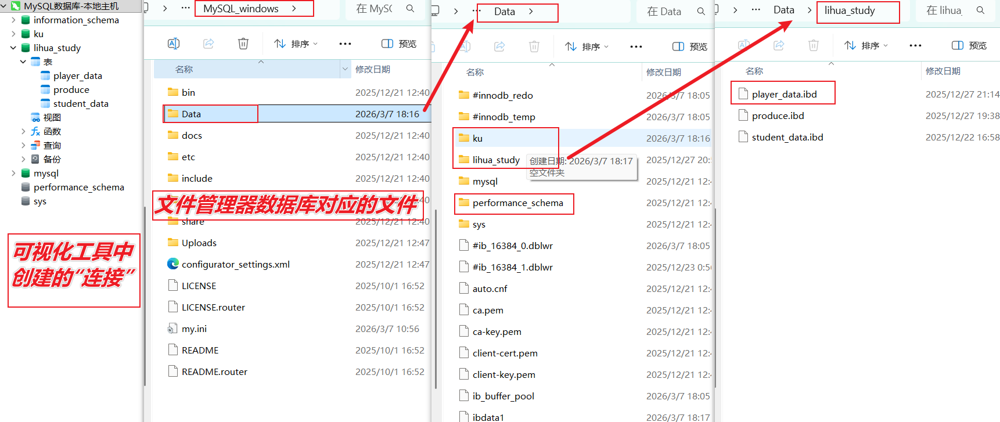
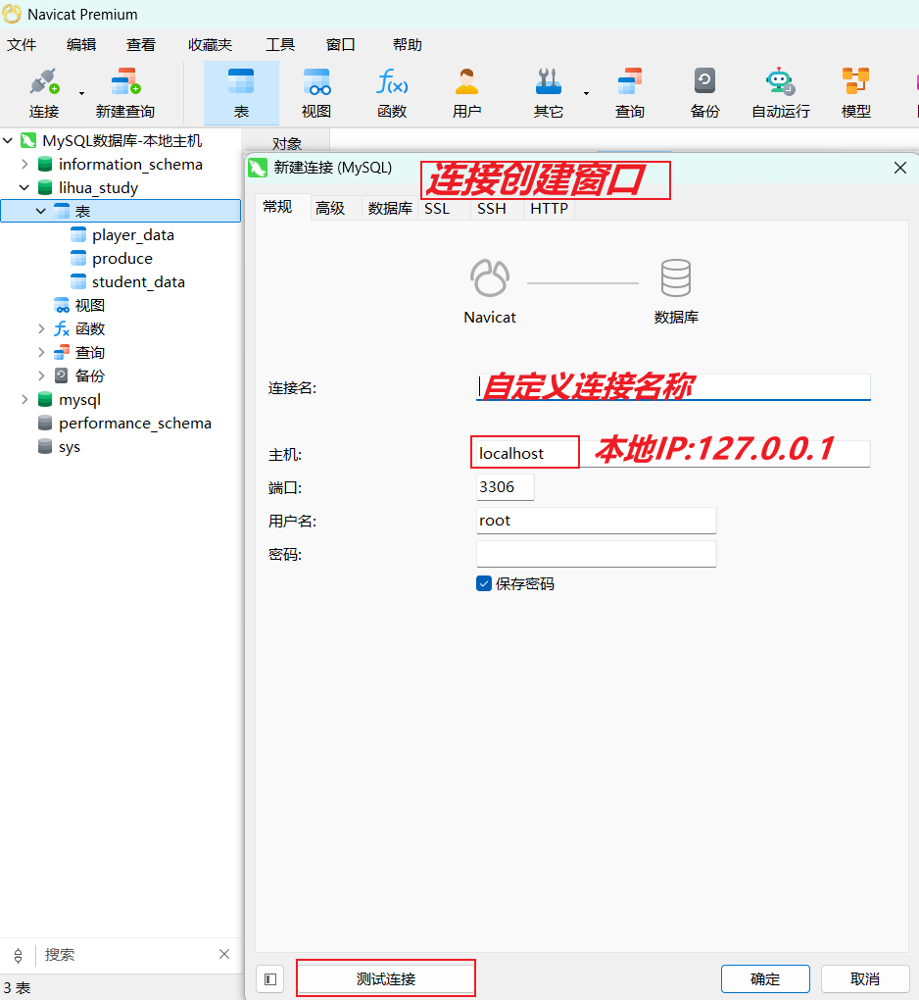
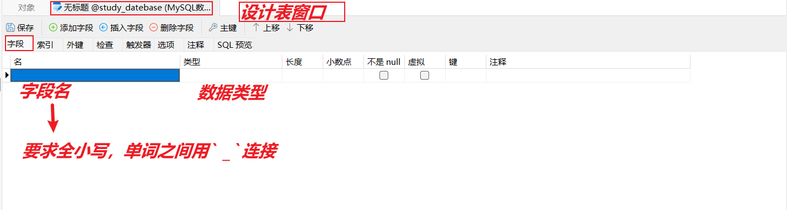
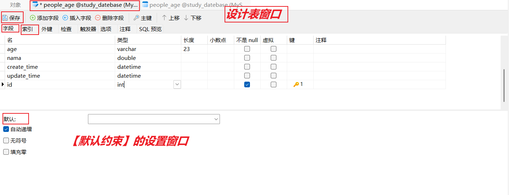
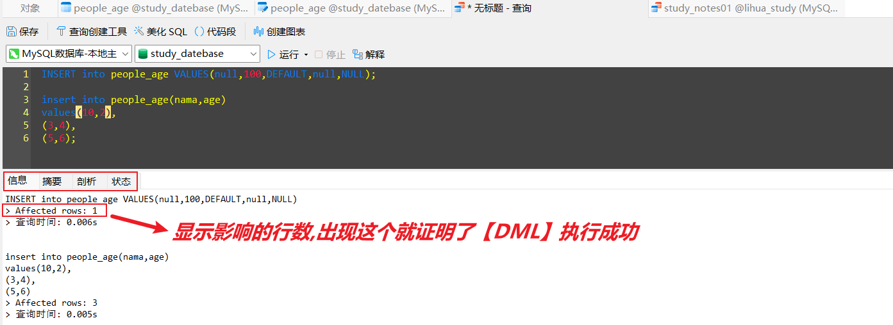
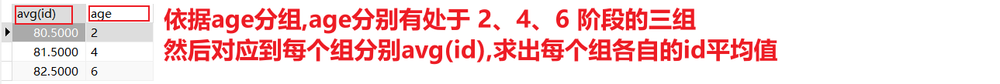
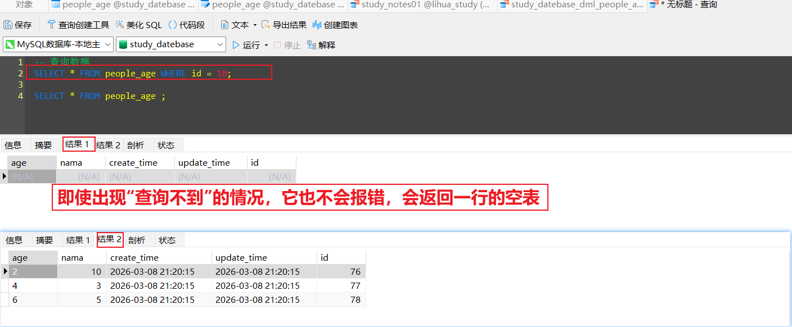

+++
date = '2025-12-20T15:13:17+08:00'
draft = false
weight = -35
title = '第一章_安装MySQL数据库+可视化工具+SQL语法'
description = '工具性质的文章-安装MySQL数据库，可视化操作工具并学习使用'
+++

**引言：**    
在windows上下载MySQL,是一个管理我们创建的**关系型数据库**的**软件**   
我们目前学习的都是**本地**上进行操作，软件是本地的，数据是本地。后面学习把本地的东西部署到远程时，只需要把一些相关的点改动一下就行


**MySQL的准备工作：**
* **初始化：**     
    1. 设置好我们数据库的**用户名**和**密码**  
    可以通过**命令行**（zip形式安装的MySQL）    
    或者**跟着指导**（图形化形式安装MySQL）   

    2. **启动**与关闭我们的MySQL    
    MySQL一定是在**启动的状态下**才能被**连接**   
    安装后之后默认就是启动状态，不要随意的关闭！！      
    **启动**的**命令行：**   
    在mysql的bin目录下执行`mysql --console`   
    **关闭**直接在**任务管理器**中关闭**exe运行程序**就可以了（非常不建议关闭）   
    当我们关闭mysql，再次打开的时候，则会因为你在关闭期间的一些操作而不能再次打开     
    例如，我调整了mysql的**安装路径**，导致他的配置文件中的**安装路径相关**的配置就失效了，必须要重新配置之后再能再次打开


**数据库结构：**   
数据库   
表：  
* 字段  
* 数据

虽然**数据库**在存储数据的方式上与**文件**划清了界限，但是数据库本质上也是文件构成的。   
**数据库**就是**文件夹**，**表**就该文件夹下的**文件**（二进制的）



**引言：**  
对**数据库**进行操作全部用命令行是完全ok的，计算机任何操作使用命令行都是能完成的。例如没有操作系统的电脑，它就会使用命令行进行打开软件、编译程序、运行程序等一系列操作。       
但是**可视化操作**却明显更方便、更直观。所以老子是真不想学命令行，于是我们使用**Navicat**连接**数据库**并操作它


## 使用可视化工具——Navicat
这是一个**轻便、小型**的操作数据库的工具       

**可视化工具如何操作数据库：**   
* **创建连接：**  
    让操作工具找到我们的数据库
    
    
    * **创建连接的相关数值：**    
    **主机**   
    填写**计算机的地址**，   
    由于你的MySQL在**本地**,填写**127.0.0.1**本地IP或者**localhost**都可以      
    如果是要连接**部署在远程服务器的数据库**，就填写服务器的**公网IP**   
    **端口**   
    自己去MySQL的**配置文件**里看，默认是3306，   
    如果地址能定位到楼栋，**端口**就是门牌号    

* **创建数据库：**   
    右键 **连接** -> 点击**新建数据库**   
    * **名称：**   
    全小写 ，单词之间用`_`连接  
    * **字符集：**   
    utf8mb4,这个字符集是支持中文的   
    * **排序规则：**  
    utf8mb4_0900_ai_ci   

* **数据库对应的表、查询**   
    **表**就是我们存储数据的单位了，表是属于MySQL的，我们在MySQL的**DATE**目录下找到       
    而**查询**就是SQL语言编写的**文件** ，这个文件不是**数据库**的内容，而是属于**操作软件**的，我们可以在操作软件的**mysql.SERVER.对应数据库**的目录下找到     
    一个**表**我们一般都会给他一个专门的**查询文件**      

**创建表：**   
右键**表** -> 点击**新建表**    
或者右键**已经创建好的具体的表** -> 点击**设计表**，就能对表的字段进行改动了    
* **建立或者设计一个 表 ，就是创建他的 字段 ：**    
    字段的创建页面就像exel表格一样  

   
    
* **表的命名：**   
全小写，单词之间用`_`分开 
    
**字段的语法：**    
    
* **数据类型:**

**数值类型**      
就常用的还是那几个，【int】、【double】     
但是，数值类型的界限是很模糊的，   
例如，  
【double】字段中填入【int】数值，是ok的，因为这符合**计算机向上兼容**的特性，跟我们之前学的一致        
而【int】字段填入【double】数值，默认状态下会**四舍五入**处理，**不会报错**。这个就能看出它的**类型限制并不严格**    


  

**字符串类型**  
主要就看两个，【char】【varchar】   
如果使用这两个类型，一定要**设置字段的【长度】**    
【char】是【长度】设置多长，内存就占多长，【varchar】是输入的【数值】多大，内存会随之调整，但不会超过【长度】   
所以【varchar】更好用

 

**时间类型**    
时间类型我们就不用过多考虑了。一般就用【datetime】，数据是**系统时间**  
* **时间相关的字段就直接设置两个**，   
一个是【create_time】记录数据的创建时间 ,     
一个是【update_time】记录数据的修改时间    
* 我们直接进行**设置默认填写时间的字段：**  
`【默认约束】填写【current_timestamp】` -> 填写数据时默认**当前的时间戳**，这个用来设置【create_time】   
`【默认约束】填写【current_timestamp】` + `【默认约束】勾选【根据当前时间戳】` -> 更改**这一行任意数据时**会默认修改时间字段的数据，改成**当前的时间戳**，这个用来设置【update_time】  


**【字段】对【数据】的其他约束：**      
  

*  **非空约束：**      
    `勾选 no null` -> 必须有数据，这一行没有数据的话，是**不能进行添加数据的操作的**
* **唯一约束：**    
    `字段的设置菜单选择【索引】` + `在【字段选项】中选择对应的字段` + `在【索引类型】中选择【unique】` 这个 **【字段】上的数据**都要是唯一的，不能重复
* **默认约束：**  
    不主动填写数值的时候，默认会填写的数值    
* **主键约束：**    
    `点击 【键】` + `【默认约束】的地方勾选【自动递增】` -> 主键就是专门用来设置**id**字段的，让**id**拥有**非空、唯一、自增**这三个特性    
    拥有**自增**特性的数据，会**默认从1给数据填写数值**，    
    如果你删除了某几行数据，它会从**最大的id号**开始往下默认填写数值，防止**重复的情况**出现      
* **外键约束：**  
    回头学到**多个【表】之间的操作**再学      

***

**引言：**   
在我们设置**字段**的时候，也就是**设计表**的时候，对类型、约束，都要一次性设计好，不要等到**表中已经插入数据后**随便改动，容易冲突     
表设计好之后，对数据的**插入、删除、修改**等操作都是通过**SQL语言**实现，不会在**Navicat**这类可视化工具中完成

**SQL语言**  
* **【查询文件(.sql)】就是SQL语言的载体：**        
他是**数据库操作工具**提供的，    
支持**选中执行**，就是你可以只选择**一部分代码**执行，不用非得整个文件一起运行    
    * `点击【新建查询】` + `对应到【连接】-【数据库】` -> 创建**查询文件**      
    【查询文件】能对它所在**连接**下的所有表进行操作，但我们一般还是让他对应到具体的**数据库**中的表
    * 【查询文件】的**命名**    
    全部小写，单词之间用`_`连接    
    库名_操作类型_表名    
    
* **SQL的操作类型：**    
SQL语言，我们就学习它对**表**的数据的操作     
**DDL**   
创建**数据库**、**表**的语句，不学！(**d**efinition)   
就用之前的**可视化操作工具**完成就行   
**DML**   
数据的**增删改**（**m**anipulation）   
**DQL**    
数据的**查询**(**q**uery)
**DCL**    
对数据的**操作权限**的控制，我们一般用不到(**c**ontrol)

所以总的看下来，我们学习的还是**CURD的业务**相关的那些语法，只不过现在操作的对象是**数据库里的那些表**   

**SQL语言总的语法注意事项：**    
* **values**(除了数值类型数据、bool值、null值、其他数据都要加’单引号’)，主键的数值填入null即可    
* **语句结尾**加上`;`号才能生效    
* **大小写**没有语法区分，   
但是建议统一**关键字**用大写   
**库名、表名、字段名**用小写    

***

**DML 添加数据**         
**添加数据**是一行一行的添加，他是横着看的    
```sql
    insert into xxx_yyy(nama,age)   
    values(10,2) ,   
    (3,4) ,   
    (5,6) ; 
```

* **指定【字段】添加**
【insert into】 **表名**（字段1，字段2） 【values】（数值1，数值2）； 

* **一整行添加**   
【insert into】 **表名** 【values】（数值1，数值2）；   
**数值**与**字段**必须一一对应     
在values（）中有**默认约束**的【字段】例如，**id**、**时间**，那你填写**default**就会按照默认填写

* **批量添加**    
【insert into】 **表名**（字段1，字段2）   
【values】（数值1，数值2），   
（数值3，数值4），   
（数值5，数值6）；


**DML 修改数据**   
**修改数据**是一列一列的修改，是修改**一个字段下的**所有数据，他是竖着看的  

```sql
    UPDATE xxx_yyy set nama = 88 WHERE id = 23 ;
```

* **修改的语句**   
【update】 **表名** 【set】 字段1=值1 ， 字段2=值2 【where】条件 ；
  
* **where 条件**    
通过条件的设置，筛选要改动的某一行或几行数据   
例如：   
where id = 1   
**条件是设计【字段】的**，可以用 `=` 、 `>` 、 `<` 、 `!=`      
特别的，`is` 和 `is not` 是判断数据是不是 **null** 用的       
逻辑符号`and` 、 `or` 、 `not` 、 `xor`    
`字段 between A and B` -> 筛选出该【字段】下数据在 **[A,B]** 范围内的数据    
`字段 in (A,B,C)`  -> 筛选出该【字段】下的数据的值是 A、B、C 的数据    
`字段 like '匹配字符'（%表示无限个通配符，_表示一个通配符）` -> 筛选出该【字段】下数据能成功匹配**匹配字符**的数据   
        
**DML 删除数据**   
**删除数据**是一行一行的删除，是直接**删除掉**一整行的所有数据   

```sql
    DELETE FROM xxx_yyy ;
```

* **删除的语句**   
【delete from】 **表名**  【where】条件 ；   

* **清空**   
【delete from】 **表名** ;     
不设置**where 条件**，自然就是清空表的所有数据

DML 的**控制台信息：**


***

**DQL 查询数据**    
**查询数据**是依据**字段**制作**表**，所以我们**select字段的时候**要一列一列看，    
但是结果是一行一行显示的，所以我们后面**设置where条件的时候**要横着看   

```sql
    select * from xxx_yyy ;
```    

* **查询部分的表，显示部分【字段】下的内容：**     
【select】 字段1，字段2 【from】 表名 【where】条件 ;    

* **查询整个表：**   
【select】 * 【from】 表名 ;   
`*`号表示**全部字段**

* **【order by】查询：**    
【order by】字段 asc  -> 数据按照**字段**进行排序呈现，**升序**   
【order by】字段 desc  -> 数据按照**字段**进行排序呈现，**降序序**    
默认就是自上而下递增的**升序**效果，**null**值会被排在最前面     
**先查询再排序**，所以语法上是：     
【select】 字段1，字段2 【from】 表名 【where】条件 【order by】字段 asc ;   

* **聚合查询**    
```sql
    select 聚合函数(字段1)，聚合函数（字段2） from xxx_yyy group by ;
```   

聚合查询是**根据一个字段**返回**一个值**，正常的查询是返回**字段下的所有数据**   
所以这两种查询操作要分成两步，不能同时进行    
但是同时查询多个**聚合函数**是OK的，而且这些**聚合函数**可以依据不同的【字段】     
* **聚合函数：**       
**max(字段)**        
返回该字段下的数据的最大值     
**min（字段）**    
返回该字段下的数据的最小值  
**sum（字段）**   
返回该字段下的数据的总和   
**avg（字段）**    
返回该字段下的数据的平均值    
**count（*）**         
上面的四个【聚合函数】的依据都只能是**一个字段**   
而**count（字段）** 则是可以根据某一个【字段】或者根据【所有字段】，这两个依据的查询结果都是一样的    
返回该字段下的数据有几个    

* **group by 设置分组**   
这是专门在**聚合查询**中使用的语法，他是把多条数据并成一条，所以只能在**聚合查询**中使用  

```sql  
    select count(*) from xxx_yyy group by 字段 ;  
    -- 他会根据group by依赖的字段，把该字段下的相同的数据合并在一起，分成一组   
    -- 然后再探讨每一组中的count（*）聚合函数，最后返回
    select count(*)，分组依赖的字段 from xxx_yyy group by 字段 ;  
    -- 为了让分组的情况显示，我们一般会把【聚合函数】和【分组依赖的字段】同时打印
```   
来张图片更明显：



* **having 条件筛选数据**     
【where 条件】它依赖的字段只能是**分组前的字段**，    
在**分组前**可以使用它对要查询的数据进行筛选   
而【having 条件】依赖的字段是**分组后的字段**，   
在**分组后**使用它对数据进行筛选   

```sql
    select 字段0 , count(字段1) as A , max(字段2)  from xxx_yyy where 条件 group by 字段0 having 条件;   
    -- 第一次where先筛选一次数据，依据的【字段】是分组前的状态，
    -- where筛选好之后进行分组  
    -- 分组之后having进行筛选，依据的【字段】是分组之后的状态
    -- 经过第二次筛选之后，返回最终结果
-- where 条件 group by 字段 having 条件，顺序一定不能乱！
-- 【as】是给【聚合函数】取别名，这样后面在having中设置相关条件    
```

现在查询大致分成**两种：**   
一个是返回一行行数据的正常查询    
一个是返回【聚合函数】计算结果的【聚合查询】    
不管是哪种查询，只要数据太多，你就可以用**分页查询**   
* **分页查询**   
只会返回**一个结果**，也就是说它返回的是完整表的**一个切片**  

```sql
    select * from xxx_yyy limit a , b ;  
    -- 会显示【第a+1行】的数据到【第a+b行】数据，也就是（a,a+b]
    -- a+1 就是起始的数据，b 是显示出来的数据的个数
> 分页查询设置的套路： 
    因为每一个【分页查询】都是完整的表的切片，   
    我们为了让切片能完整的对接上，就必须设置好每次【分页查询】的【a】起始值    
    公式：  
    【页面起始数据的标识】a = (当前的页面-1)*页面的大小【b】  
```

* **嵌套查询：**   
因为【聚合函数】的值，我们可能在**设置条件的时候**我们想拿来用，   
那我们就要先获取这个值，才能用，获取【聚合函数】的值，就是【聚合查询】   

```sql
    select * from xxx_yyy where 字段 > (select max(字段) from xxx_yyy) ;
```   

**DQL 查询数据的【关键字】很多，我们要理清一下它的逻辑上的先后**   
* **正常的查询**

```sql
    select 字段1，字段2 from xxx_yyy where 条件 order by 字段 asc limit a,b ;
```

* **聚合查询**
```sql
    select 字段1，聚合函数(字段2) as A ，聚合函数(字段3) from xxx_yyy where 条件 group by 字段 having 条件 order by 字段 asc limit a,b ;
```


DQL 的**控制台信息：**


***

### Navicat的使用技巧
**Navicat工具的快捷键:**     
`ctrl + d` -> 在**查询文件**中写SQL语句的快捷向下复制

* **所有对数据库的操作和改动都需要保存后才能生效！！**    
**及时的刷新，才能拿到最新的数据**


