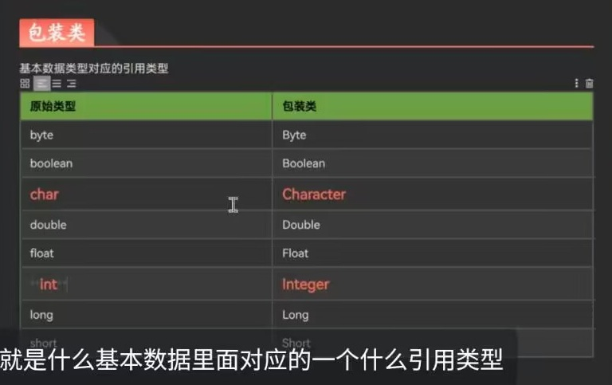

+++
date = '2025-12-17T01:30:23+08:00'
draft = false
weight = 8
title = '第七章_集合'
description = '笔记性质文章/标志性质的文章-学习集合这一【容器】，标志这早期后端java的正式结束'
+++
引言：集合是一种【容器类】，关于容器的学习，我们遵从CURD思维学习他的业务方法，然后学习他自己的特点，依照对比特点的学习方式来判定他的使用场景，【String】类本质上也是容器类

## 集合
* 是一种容器，相对于【数组】定义之后长度固定，集合是可以自动扩容的  
    **集合类的族谱：**  
集合
-【单列集合】 | 【双列集合】

【单列集合】，一个元素只有一个数据
*单列集合的顶级接口【Collection】
被继承的接口 
    - 【List】`有序，可重复`; 大部分时候都是使用他的【Arraylist】实现类 | 
    【set】`无序，不可重复`; 一般只在使用“不可重复”的集合时，
      主要掌握他的【Hashset】实现类

【双列集合】，一个元素有两个数据 `key = value`，即一个【键值对】  
*双列集合，主要掌握一个【HashMap】实现类就行

* **【List】的实现类**
##### 【Arraylsit】
    遵循CURD学习思路，学习容器的方法
```java
    > 特点
        1. 有序
        2. 有索引-因为底层是数组（*容量可变设计*）
        3. 线程不安全
      数据结构：数组  
---------------------------------------------------------------
    > 观察构造器
        |new ArrayList()
        |new ArrayList(int 初始容量)
      *  增删改查的业务方法都是重写【父类】/【接口】
        所以创建的时候，很多都是用“多态创建” 
--------------------------------------------------------------
    > 观察成员方法   
        1. 查
            al.size() -> 返回集合的长度
            al.get(int index) -> 根据索引查元素，返回元素
           -al.indexOf(对象) -> 根据首个对象查索引，返回索引
           -al.lastIndexOf(对象) -> 根据最后的对象查索引，返回索引

        2. 增、删、（改）
           -al.add(对象) -> 增加元素的操作，返回<boolean>值
           -al.add(int index,对象) -> 根据索引插入元素
           -al.remove(int index) -> 根据索引删除元素,返回被删除的元素
           -al.remove(对象) -> 删除首个元素, 返回<boolean>值
            al.set(int index,对象) -> 根据索引修改元素，返回旧的元素
            al.clear() -> 清空所有元素，无返回值
        
        3. 判断
            al.isEmpty() -> 判断集合是否为空
            al.contains(对象) -> 判断是否包含指定的元素    

        4. 类型转换
            al.iterator() -> 返回迭代器
            al.toArray() -> 返回数组    
----------------------------------------------------------------
    > 重写的【Object】方法
        1. 重写了[equals] -> 比较元素的内容是否一致，返回<boolean>值
        2. 重写了[toString] -> 打印展示所有元素的字符串            
```

* 与【Arraylsit】平级的类 - 【LinkedList】，【业务方法】基本一致
> 本质区别就在【数据结构】：
1. 【Arraylsit】，查询较快，增删修改较慢
2. 【LinkedList】，查询较慢，增删修改较快  

```java
    > 特点
        1. 有序-根据逻辑索引排序，【业务方法】与索引相关的，使用逻辑索引
        2. 无索引-因为底层是链表
        3. 线程不安全
      数据结构：双向链表（*容量可变设计*）  
    # 一般只在有大量的【删改】业务的时候才会用【LinkedList】  
-----------------------------------------------------------------      
    > 重写的【Object】方法
        1. 重写了[equals] -> 要求元素的【内容+顺序】都一致，返回<boolean>值
        2. 重写了[toString] -> 打印展示所有元素的字符串
-----------------------------------------------------------------
    > 【业务方法】中适应链表结构的增加高效处理头尾数据的【方法】
        -ll.addFirst() -> 快速添加头元素
        -ll.addLast() -> 快速添加尾元素 
        -`get`/`remove`/的方法增加`First/Last`      
```

***
* **【Set】的实现类**
> 【HashSet】类与【Link】中的【Arraylsit】【LinkedList】区分：
1. 【业务方法】中没有与索引相关的方法，其他方法都有
2. 【Object】重写的方法和【ArrayList】的重写一致
#我们一般只有当集合有要求元素不能重复时才用【HashSet】


***
* **【Map】的实现类**
> 【HashMap】,其实相对【单列集合】，就是元素的逻辑索引变成`key`

```java
    > 特点
        1. 无序
        2. 无索引-因为底层是哈希表
        3. `key`唯一，`value`可重复，同样都是【对象】类型
        4. 线程不安全
      数据结构：哈希表
------------------------------------------------------------
    > 观察成员方法         
        1. 查
            hm.size() -> 返回【键值对】个数
            hm.get(对象*key) -> 返回对应的【值】

        2. 增、删、（改）
            hm.put(对象*key，对象*value) -> 添加/修改【键值对】
            hm.replace(对象*key，对象*value) -> 修改【键值对】，返回boolean值
            hm.remove(对象*key) -> 删除整个【键值对】
            hm.clear() -> 清空集合

        3. 判断
           -hm.containsKey(对象*key) -> 判断是否有这个【键】
           -hm.containsValue(对象*value) -> 判断是否有这个【值】

        4. 类型转换   
            hm.keySet() -> 获取所有【键】，返回【Set】类集合
            hm.values() -> 获取所有【值】，返回【Collection】类集合
            hm.entrySet() -> 获取所有【键值对】，返回【Set】类集合 
-------------------------------------------------------------------
        > 重写的【Object】方法
        1. 重写了[equals] -> 要求元素的【键值对】都一致，返回<boolean>值
        2. 重写了[toString] -> 打印展示所有元素的字符串
```


***
## **集合的存储**
1. 集合只能存储【引用类型】数据,可以是`null`
2. 集合可以存储不同类型的数据,但我们一般都要用[**<泛型>**](#泛型)规定存储的数据的类型


***
## **集合的遍历**
* 集合的特有遍历方法：  
集合 -> 迭代器（**集合一般都是这么遍历的**）

```java
    > 迭代器遍历法：
        1. 获取集合对应的【迭代器】
            集合都有的方法： 集合.iterator() -> 返回迭代器对象
            `集合.iterator().var` -> 简写创建迭代器对象
        2. while(it.hasNext()){
            Integer next = it.next();
            next.sout
        }    
    --------------------------------------------------
    > 迭代器的常用方法
        【迭代器】是一片连续的空间
        it.hasNext() -> 判断当前指针后移后有没有数据
        it.next() -> 同时指针后移，获取指针的数据
        it.remove() -> 删除当前指针指向的元素
      * 【迭代器】是一次性遍历工具，指针位置调整之后就没办法复原了  
         指针最开始指向【首个元素】的前面，是空的空间，
         这个时候用`it.remove()`方法会报错
```

* 容器的遍历
1. 索引遍历法：  
    根据【逻辑索引】遍历，【有序集合】【数组】都能通过这个方法遍历

2. **增强for循环**<sup>也称for-each</sup>:    
    这是一种语法糖，遍历数组 -> 就是走【索引遍历法】|  
    遍历集合 -> 就是走【迭代器遍历】 
```java
    for(每一项的类型 item : 【数组】/【集合】){  
        item.sout  
    }
``` 

* 遍历的选择：
    1. 索引遍历法，灵活可变-留有索引，能进行跳跃遍历、倒序遍历等操作
    2. 增强for循环、迭代器遍历，有序遍历效率更高 


***
#### 泛型
* 是一个针对【类】的语法
1. 创建时：<E> 
    类名称<E>
    在这个类中所有出现类型的地方，都可以把类型替换成<E>
2. 使用时：创建对象时，你可以 类名称<具体引用类型>的形式创建对象->启用指定泛型
    这样，在对应的类中的所有<E>会变成<具体引用类型>

* <>只能是接收引用类型，当需要接收基本数据类型时，则用到[**包装类**](#包装类)    


#### 包装类
* 提供把【基本数据类型】 -> 转换成【引用数据类型】的一种类

* 这时候基本数据类型就能存放入<泛型>中了

```java
    > 观察构造器
        |new Integer("对应类型的字符串") -> 如果类型不一致，报错
        |new Integer(int i)
    -------------------------------
    > 观察方法
        【类方法】 - Integer.valueOf(int i) -> 返回包装类对象
        
        【实例方法】
        i.xxxValue() -> 返回xxx基本类型的数据
        i.parseInt(String s) -> 把对应字符串转换类型，如果类型不一致，报错
    --------------------------------
    > 自动拆箱/自动装箱
        Integer i = 10; 
        int a = i;
        -> 系统会自动转换包装类和基本数据类型       
```
