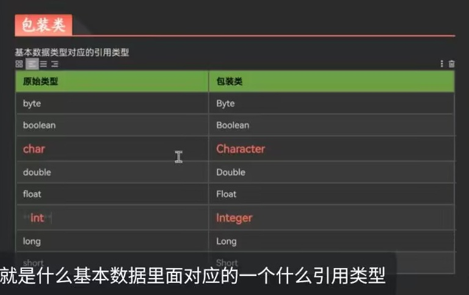

+++
date = '2025-12-17T01:30:23+08:00'
draft = false
weight = 8
title = '第七章_集合'
description = '笔记性质文章/标志性质的文章-学习集合这一【容器】，标志这早期后端java的正式结束'
+++

**引言：**  
集合是一种**容器**  
我们在java中，学了两个容器，【数组】和【集合】  
关于容器的学习，我们遵从CURD思维学习，    
在以后写代码时，我们基本上不会使用【数组】，大部分都是用【集合】    
因为【数组】**定义之后长度固定**，【集合】是能扩容的   

    
**集合类的族谱：**  
集合在种类上可以分成 **单列集合**、**双列集合**   

单列集合，**一个元素就有一个数据（对象）**   
**单列集合的顶级接口【Collection】**     
【Collection】的【实现类】： 

* **【List】接口**  特性是**有序，可重复**    
    【ArrayList】实现【List】接口，我们写集合时大部分创建的都是【ArrayList】     

    * **ArrayList:**  
    特点是   
    **有序**，**元素位置**是固定的，每次遍历的结果都是一致的   
    **有索引值**，【ArrayList】的底层是【数组】，元素都是有索引的   
    **线程不安全**，这个特点我先记在这了，原因回头会学到
    **元素可重复**，元素重复添加时，**地址**会在新位置再存放一次

```java
    public static void main(String[] args) {
        ArrayList<Object> xxxYyy = new ArrayList<>();
        // 创建时设计【泛型】
        // `new ArrayList<>().var`简写
    }

    集合的方法：  
        1. 查
            al.size() -> 返回集合的长度
                // 像 array.length 返回数组长度
            al.get(int index) -> 根据索引查元素，返回元素
                // 像 array[index] 数组的查找一样
           -al.indexOf(对象) -> 根据首个对象查索引，返回索引
           -al.lastIndexOf(对象) -> 根据最后的对象查索引，返回索引
            // 想象像 array[对象] 一样，其实方法的名称和中文一样
            // .indexOf 对象 就是返回 对象的索引值

        2. 增、删、（改）
           -al.add(int index,对象) -> 根据索引插入元素
           -al.add(对象) -> 增加元素的操作，返回<boolean>值
        //    依据【索引值】为参数，就会返回【元素】
        // 依据【元素】为参数，就会返回【boolean】值，告诉你增或删的操作有没有成功
           -al.remove(int index) -> 根据索引删除元素,返回被删除的元素
           -al.remove(对象) -> 删除首个元素, 返回<boolean>值

            al.set(int index,对象) -> 根据索引修改元素，返回旧的元素
            al.clear() -> 清空所有元素，无返回值
        
        3. 判断
            al.isEmpty() -> 判断集合是否为空
            al.contains(对象) -> 判断是否包含指定的元素    

        4. 类型转换
            al.iterator() -> 返回迭代器
            al.toArray() -> 返回数组 

    > 重写的【Object】方法：
        1. 重写了[equals] -> 比较元素的内容（顺序和元素）是否一致，返回<boolean>值
        2. 重写了[toString] -> 打印展示所有元素的字符串  
        // 【集合】直接打印就能显示出所有的元素，不用遍历
        // 【数组】需要用到Arrays.toString(数组)才能打印出全部元素 
```    
**小小拓展一下：**
同样是实现【List】接口的【LinkedList】类，   
【ArrayList】有的那些成员方法他都有。他与【ArrayList】本质区别就在【数据结构】：   
【Arraylsit】，底层是**数组** 查询较快，增删修改较慢
【LinkedList】，底层是**链表** 查询较慢，增删修改较快    


* **【Set】** 特性是**无序，不可重复**  
    【HashSet】实现【Set】,当我有需求**元素不能重复**时使用【HashSet】
    * **【HashSet】：** 
    特点是   
    **无序**，每次打印时，元素可能就不在之前的位置了   
    **没有索引值**，【ArrayList】有的那些成员方法他都有，除了**与索引值相关的**，例如`.get(index)` 、 `.indexOf(元素)`   
    **元素不可重复**，元素重复添加时，**地址**不会存放第二遍

```java
    HashSet<Object> hs = new HashSet();
```    

【双列集合】，**一个元素就是一个【键值对】（两个对象）， `key ： value`**    
* **掌握一个【HashMap】实现类就行**

    * **【Map】的实现类【HashMap】**  
    【HashMap】,其实相对【单列集合】，就是元素的索引值变成`key`
    特点是  
    **有序** 
    **没有索引值**   
    **`key`是唯一的**，**`value`可重复**  
    **线程不安全**

```java
    HashMap<Object, Object> hm = new HashMap();
    // 泛型输入两个类型，分别限制【key】【value】两个对象

> 成员方法：
    //基本上就是名字换了一下  
        1. 查
            hm.size() -> 返回【键值对】个数
            hm.get(对象*key) -> 返回对应的【值】

        2. 增、删、（改）
            hm.replace(对象*key，对象*value) -> 修改【键值对】，返回boolean值
            hm.put(对象*key，对象*value) -> 添加/修改【键值对】，返回旧的value
            hm.remove(对象*key) -> 删除整个【键值对】
            hm.clear() -> 清空集合

        3. 判断
           -hm.containsKey(对象*key) -> 判断是否有这个【键】
           -hm.containsValue(对象*value) -> 判断是否有这个【值】

        4. 类型转换   
            hm.keySet() -> 获取所有【键】，返回【Set】类集合
            hm.values() -> 获取所有【值】，返回【Collection】类集合
            hm.entrySet() -> 获取所有【键值对】，返回【Set】类集合 

> 重写的【Object】方法:
        1. 重写了[equals] -> 要求元素的【键值对】都一致，返回<boolean>值
        2. 重写了[toString] -> 打印展示所有元素的字符串
```


***
**集合的存储特性：**
* 集合只能存储**引用类形数据**,`null`是空指针，所以也能存入     
那我们不得不讲到**包装类**了
    * **包装类：**    
    【基本数据类型】 -> 转换成【引用数据类型】   
    这样我们就顺利的**在集合里面添加【基本数据类型】的数据**
```java
    ArrayList<Integer> al = new ArrayList<>();
```        

   

```java
    Integer i = new Integer("对应基本类型的字符串") ;
    Double d = new Double(double i) ;

> 观察方法
        【类方法】
        Integer.valueOf(int i) -> 返回包装类对象
        // 这个类方法就是一种创建对象的方法，跟上面两个一样
        Integer.parseInt(String s) -> 把字符串 转换成对应【基本数据类型】
        
//但其实【基本数据类型】 <-> 【引用数据类型】不用专门创建，
// 系统会自动【拆箱/装箱】，也就是自动类型转换 
        【实例方法】
    类型转换    
        i.xxxValue() -> 返回xxx的【基本类型的数据】
```


* 集合可以存储不同类型的数据,但我们一般都要用 **<泛型>** 来规定存储的数据的类型，**强制集合里面的元素类型统一**  
    * **泛型：**   
    对象创建时规定类型，会影响到**类这个模板本身：**
```java    
    ArrayList<Object> al = new ArrayList<>();
```  
    在类这个模板中的影响：
```java
    public class XxxYyy<E>{
        E xxxYyy ;
        public E xxxYyy(){

        }
// 因为创建时用的<Object> 
// 所有的E都会被替换成 【Object】
    }
```    

***

**集合特有的遍历方法：**  
迭代器，**集合一般都是这么遍历的**

```java
    ArrayList<Integer> al = new ArrayList<>() ;
    // 创建集合对象

    Iterator<Integer> it = al.iterator();
    //  `集合.iterator().var` -> 简写创建迭代器对象
    // al.iterator()这个成员方法，是所有集合类都有的
    // 【迭代器】和【集合】的【泛型】必须一致

    while(it.hasNext()){
        Integer next = it.next();
        // 获取每一个元素
    }    

> 迭代器的常用方法
        it.hasNext() -> 判断当前指针后移后有没有数据
        it.next() -> 指针后移，并获取指针的数据
        it.remove() -> 删除当前指针指向的元素
    // 【迭代器】是一次性遍历工具，指针位置调整之后就没办法复原了  
```

**容器的遍历**   
1. **索引遍历法：**  
    根据【逻辑索引】遍历，【有序集合】【数组】都能通过这个方法遍历

2. **增强for循环**<sup>也称for-each</sup>:    
    这是一种语法糖   
    遍历数组 -> 就是使用【索引遍历法】  
    遍历集合 -> 就是使用【迭代器遍历】 
```java
    for(每一项的类型 item : 【数组】/【集合】){  
        // 此时拿到每一个元素并赋值给【item】
    }
``` 

* **遍历的选择：**   
    **索引遍历法**，能进行跳跃遍历、倒序遍历等操作
    **增强for循环**,一般用这个就行 


