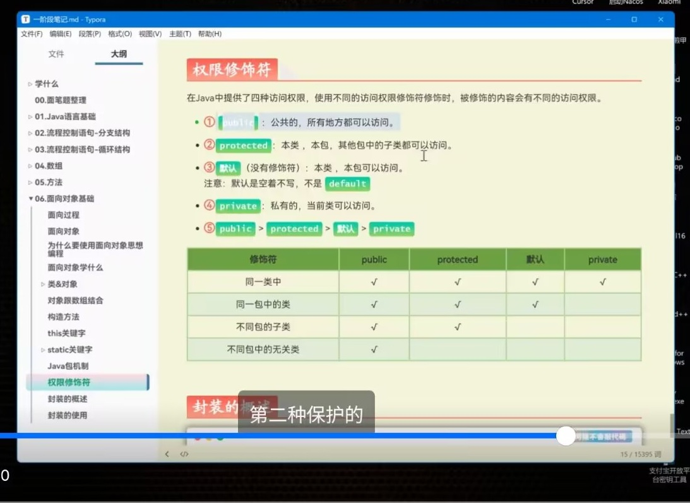
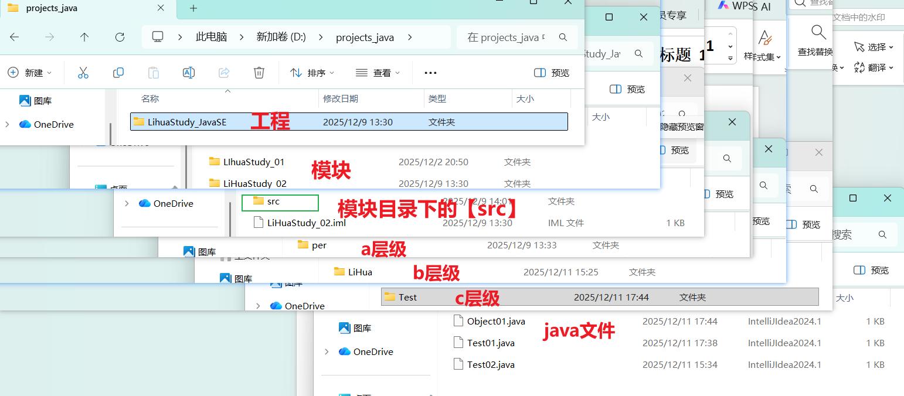

+++
date = '2025-12-11T15:46:10+08:00'
draft = false
weight = 4
title = '第三章_类和对象'
+++

### 编程思维
> C语言 -> 面对过程：全部事情自己做  
> java -> 面对对象： 能用别人的就用别人的 |（不要重复造轮子）  
* 一我们要会用
* 二我们要会写

***
# 类和对象

* 类，**作为模板提供给 【对象】**
1. 【类】是完全服务于【对象】的  
【对象】的创建：  
` 类 对象名 = new 类() ;` --> 【对象】是引用类型数据 
*可以简写成`new 类().var`  
对象名：`包名称.类@地址`


> * ## 类的结构

* ### 成员( 属性 | 方法 )
```java
  # 访问方法：
  【对象名】.成员  --> 对象会拿到所有成员（*不考虑权限修饰符*）
```

* ### 在类中使用的关键字
    1. `static` 关键字 -> 把【成员】提升至类级，即“静态成员”，
    生命周期：在类被创建时存在，而【实例成员】在对象创建时存在
    ----------------------
```java

    *并不会对【对象访问成员】的行为造成任何限制
    但把成员内部进行的划分【static静态成员】 | 【实例成员】

    - 【静态成员】比【实例成员】多出来了什么？

    访问方式|  【类.成员】也能访问到，<在类外>免去了【创建对象】的行为，
    直接访问，方便快捷
    * <在类内部>用【类.成员】访问可省略成【成员】

    限制|  <类内部>【静态成员方法】内只能访问【静态成员】
    * 生命周期原理：有【类】的时候不一定有【对象】
        【实例成员方法】能访问所有【成员】

    特点| 【静态成员】属于类级，数值改变的话，影响的是整个【类模板】
    而非【对象】

    ------------------------
    # <类内外>访问成员的问题
        **<类内部>访问成员不会受到`权限修饰符`的影响
        【静态成员】- 在<类内部>/<类外部>都可以通过【类.成员】访问
        【实例对象】- 在<类内部>通过【this.实例成员】访问
        `this`只服务于【实例】，但只能在<类内部>使用
【对象.成员】--> 访问【静态成员】等价【类.成员】（*推荐直接用【类.成员】*）
【对象.成员】--> 访问【实例成员】来互补`this`的访问功能，实现<类外部>访问

    ---------------------------
```

2. 【权限修饰符】-> 现不考虑细化使用到【类】，主要还是作用于【成员】


* 该图片标注的仅仅是【权限修饰符】对【访问】行为的影响,结合[包机制](#java的包机制)

```java
    # 我们大部分情况下，只是用`private`和`public`这两种辨析成员【私有/非私有】

    * 私有封装设计：【成员变量】全部`private`,统一用【get/set】方法，
    来设计可以被外界访问的成员变量
```

***
* ### 构造器（又称构造方法）
    在【对象】创建的时候被调用，*具有最高的调用优先级* -> 一般用于【对象成员】的赋值
    * 本质就是一个优先调用的方法
```java
    > 格式：
    无【返回值】，方法名就是【类名】
    类（形参）{}
    ----------------
    # 可以【方法重载】
    * 系统默认提供【无参构造器】，可是当你写入【有参构造器】时，不再提供
    如有需求，自己再写 
```
* **一个【类】的完整结构如下**
```java
    class 类{
        1.【成员属性】
        2.【构造器】
        3.【成员方法】
        4.【get/set】方法 *本质上就是【成员方法】-> 得到/改变【成员属性】
    }
    ------------------
    `insert(fn + delete触法) + alt`/`右键 + Generate`-->快速构建【类】的基本结构
```


***
> * ## 类的成员变量 和 临时变量（局部创建/参数传入）

* ### 变量优先级处理
    遵循【就近原则】
```java
    # 区分：
    <类外> - 【对象.成员】|【类.静态成员】|
    <类内> - 【this.实例成员】|【super.父类成员】|【类.静态成员】
    |【变量名】(*方法的定义的局部变量*)
    ---------------------
    # 什么时候用【成员属性】，什么时候用【临时变量】？

    1.当一个【变量】你想让它在整个对象中被访问，则是【全局变量】，
    用【成员属性】，这个值是共同作用的产物

    2.当一个【变量】你想让他只在一个【代码块】内部生效，则是【局部变量】，
    用【临时变量】接住一个值，这个值不会对外界产生影响（*除非是【返回值】*）

    3.方法的【参数】，本质上是接住【实参】，然后做【临时变量】接住它，
    只有当这个方法被嵌套在另一个方法中，作为【内部代码块】，
    用【参数】接住【外部代码块】的【临时变量】
```

# 类和类之间
1. 子类【继承】父类
2. 实现类【实现】接口

> * ## 类的继承（拓展）
    
* ### 格式和意义
    当有多个【相关类】，把相同的【成员】抽出，构建【父类】
    【子类】继承所有【非私有成员】
```java
    1. 【子类】规范
    class 子类 extends 父类{
------------------------------------------------------------【成员】
    # 当【成员】冲突（重名）时，<就近原则>访问子类的

    解决冲突办法：【super( )】调用父类构造器 | 【super.成员】访问父类成员
    跟【this】一样，只服务于【实例】，不能访问/存在于【静态成员】
-------------------------------------------------------------【构造器】
    # 子类【构造器】系统默认“第一行”提供【super( )】方法
    >生命周期原理：【父类成员】就位，子类才能继承，
        所以要求【父类构造器】必须优先【子类构造器】执行

    # 如果你写了【父类有参构造器】->系统不会提供【父类无参构造器】，
    如果不走【super（有参）】，记得自己补回【父类无参构造器】    
-------------------------------------------------------------【方法】
    > 方法重名，即【方法重写】--> 适应多态

    @override --> 起到(标明 + 检查重写语法)的作用
    完全相同的方法声明（返回值|方法名|关键字）{
        ·重写方法体·
    }
--------------------------------------------------------------【get/set】方法
    }
```


***
##### java的包机制
* java的包创建：  
工程 -> 模块<sup>src文件夹</sup> -> 创建包<sup>包分三层</sup>  
包命名（其实就是【域名】倒写）1. 全小写 2. 用【.】分割的单词只能是单数形式，且只有一个单词


* 包命名的三个层级：
- a层级：开发团队的性质（公司com | 非营利组织org | 个人per）
- b层级：团队名称
- c层级：具体的技术功能