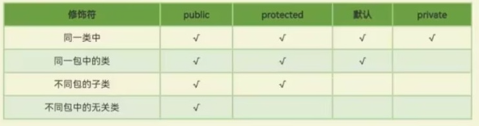

+++
date = '2025-12-11T15:46:10+08:00'
draft = false
weight = 4
title = '第三章_类和对象'
description = '笔记性质文章-成功构建【面向对象编程】思维'
+++
**引言：**  
上一节课中，我们学习的基本是一个类可能出现的语法  
但其实一个类的创建是有套路的，类是有结构，而且类的使用基本是多个类的相互关联的，因为java这个高级语言是**面向对象编程**  
这篇文章我们从“一个类的构建”、“类和类之间的关系”两个角度学习


* **高级语言的编程思维：**  
C语言 **面向过程：**  
在一个程序中完成所用任务，整个任务是能落实到每一步代码的  
java、python、c++  **面向对象：**  
能用别人的就用别人的 |（不要重复造轮子），是把整个任务分成一个个对象，创建不同对象去解决不同的部分   


***
**类和类之间的一种关系：类和对象的关系**

* 类，**作为模板，提供给 【对象】**   
【类】是完全服务于【对象】的  
【对象】的创建：  
` 类 对象名 = new 类() ;` --> 【对象】是引用类型数据   
可以简写成`new 类().var`  
对象名，是地址白变量：  
.toString( ) -> `包名称.类@地址`

之前说过【类】就是【文件】，所以我们创建的【对象】一般不在它的【类】里面的，也就是说**对象的创建和使用**是两个文件之间的事


***


* **一个【类】的基本结构如下**

```java
    package 包 ；
    import 【导入的类的全称】；

    public class XxxYyy{

        *public* int xxxYyy ;
        *public* int[ ] xxxYyy ;
    // 【成员属性】

        *public* 文件名XxxYyy ( ){

        }
    // 【构造器】,又称【构造方法】

        *public* void xxxYyy( ){
            实现功能的代码 ；
        }
    // 【成员方法】

        public void set成员属性(类型 arg) {
            this.成员属性 = arg ;
        }
        public 成员属性的类型 get成员属性( ) {
            return this.成员属性 ;
        }
    // 4.【getter/setter】方法 
    // 本质上就是【成员方法】， 功能是 返回/改变【成员属性】
    }
```

* **这些结构不用自己写！**  
    `insert(fn + delete触法) + alt`/`右键 + Generate`-->快速构建【类】的基本结构     

* **成员( 属性 | 方法 )**  
    1. **访问 ：**
    对象已经创建后，
    【对象名】.成员属性 -> 返回【成员属性】  
    【对象名】.成员方法( ) ; -> 调用【成员方法】

* **构造器（又称构造方法）**
    在【对象】创建的时候被调用，具有最高的调用优先级  
    一般用于【对象的成员属性】的赋值  
    * 【类】是模板：    

```java
    public class XxxYyy(形参1，形参2) {
        this.成员属性1 = 形参1;
        this.成员属性2 = 形参2;
    }
```

* 【对象】，又称【实例】，当 **【成员属性】是具体数值时**，对象就是一个基于【类】而创建的个体  
```java
    XxxYyy 对象名 = new XxxYyy(实参1，实参2) ;
```

* **【构造器的特性】：**    
    因为【构造器】是一种方法，所以可以**方法重载**  

    默认拥有【无参构造器】，  
    可是当你写入【有参构造器】时，不再提供如有需求，自己再写 


***
> ## 类的成员变量 和 临时变量（局部创建/参数传入）

*  **变量优先级处理**  
    遵循【就近原则】
```java
    # 区分：
    <类外> - 【对象.成员】|【类.静态成员】|
    <类内> - 【this.实例成员】|【super.父类成员】|【类.静态成员】
    |【变量名】(*方法的定义的局部变量*)
    ---------------------
    # 什么时候用【成员属性】，什么时候用【临时变量】？

    1.当一个【变量】你想让它在整个对象中被访问，则是【全局变量】，
    用【成员属性】，这个值是共同作用的产物

    2.当一个【变量】你想让他只在一个【代码块】内部生效，则是【局部变量】，
    用【临时变量】接住一个值，这个值不会对外界产生影响（*除非是【返回值】*）

    3.方法的【参数】，本质上是接住【实参】，然后做【临时变量】接住它，
    只有当这个方法被嵌套在另一个方法中，作为【内部代码块】，
    用【参数】接住【外部代码块】的【临时变量】
```


***

**在类中重要的关键字**  
这些关键字在上一章的散点语法中没有出现，是因为在**一个类中**讨论他们是没有意义的，但是我们现在学习创建【类】、【对象】都将在**不同文件**中考虑，此时，他们至关重要！  

    * **【static】静态**  ，在【成员】的声明中使用
```java
    public class XxxYyy{
        public static int a;
        public static void xxxYyy( ) {

        }   
    //  加上static，就是【静态成员】，如果没有static就是【实例成员】
    //  静态成员是在【类】被创建的时候就存在了，而实例成员是【对象】被创建的时候才存在了
    }
```     
【static】给【成员】的**赋能作用：**  
【静态成员】不需要创建对象后，用`对象名.成员`的方法 访问或调用，他能直接用`类名.成员`的方法 访问或调用。我们也更提倡用这个方法  


在**类创建的时候**，`成员名` 就是【静态成员】 ，`this.成员`表示【实例成员】


【static】给【成员】的**限制作用：**  
是针对**类创建的时候**的限制，【静态成员方法】内只能访问【静态成员】

【静态成员属性】属于【类】，当它的数值被改变时，**会影响到【类】这一模板本身**   

* **【this】** 只服务于【实例成员】的关键字：  
它只会在**类中**被使用到，是在**类中**访问或调用【实例成员】的方法  
**其他类**中是`对象.成员`访问【实例成员】，**类创建的时候**则用`this.成员`访问


* **权限修饰符** ，在【成员】的声明中，或者在【类】的声明中使用，  
在一个类中权限修饰符不会产生作用的，他的作用是在**类与类**之间的。  
还有对【类】讨论权限修饰符暂不考虑，我们都用`public class XxxYyy{ }`    


我们大部分情况下，只使用`private`和`public`这两种辨析成员【私有/非私有】  
**私有：** 只能在**类中**被访问  
**非私有** 则是整个**工程**中的所有类都能访问  
* 私有封装设计：  
【成员变量】全部`private`,   
统一用【getter/setter】方法，来设计可以被外界访问或改变的【成员变量】

***

**类和类之间的第二种关系： 继承 与 实现**

    
*  **子类【继承】父类：**   
    当有多个**相关的类**，把相同的【成员】抽出，构建【父类】  
    【子类】将继承所有【非私有成员】，继承与【访问的权限修饰符】无关，  
    **【子类】将继承所有【非私有成员】** 是继承的唯一规则
```java
    public class 子类 extends 父类{

        1.【成员： 成员属性、成员方法】
        // 当【成员】冲突（重名）时，符合<就近原则>，会访问子类的
// super关键字：
// 【super.成员】访问父类成员
// 跟【this】一样，只服务于【实例成员】- 父类的【实例成员】

        // 【成员方法】的重名，又称【方法重写】，这是一种 “适应继承多态特性”的好行为
        @Override
        public 方法声明与【父类】一致( ) {
            重写【方法体】 ;
        }
        // @override 起到(标明 + 检查重写语法)的作用

        2. 【构造器】
        // #子类【构造器】会默认“第一行”提供【super( )】方法
// super( )这个语法只能写在构造器中，且必须是第一行 
        // 因为生命周期原理：【父类成员】就位，子类才能继承，
        // 所以要求【父类构造器】必须优先【子类构造器】执行
        //  如果你写了【父类有参构造器】，此时，父类不会提供【父类无参构造器】，
        // 这时候，如果不走【super（有参）】，记得自己补一个【父类无参构造器】，防止【子类】的super( )语法引发报错    

        3.【getter/setter】
        // 继承父类时，是继承父类的【非私有成员】，但是【父类成员属性】又需要`private`封装保证，
        // 所以我们让子类直接继承 getter/setter 方法，保证子类可以访问和修改【父类成员属性】
    }
```

* **引言：**  
了解类和类之间父子关系，就是为接下来的**抽象类**和**接口**做准备  
这两中类都是**一种模板**，是对他们子类的**一种规范**，规范的方式就是用【抽象方法】   
他是由我们之前谈论的**类规范对象的创建**过渡到现在的**类规范类的创建**

* **实现类【实现】接口** 

