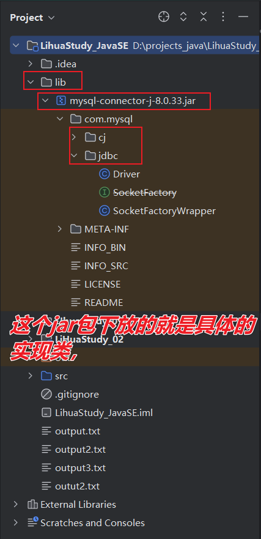

+++
date = '2025-12-22T21:51:10+08:00'
draft = false
weight = -34
title = '第二章_JDBC接口'
description = '笔记性质的文章-idea连接我们的数据库'
+++

**引言：**    
在上一章中，我们学会了**操作工具**联系我们**数据库**   
进而创建了**数据库**存储数据的基本结构**表**   
然后学习了SQL语言中的DML和DQL对我们数据进行**CURD业务操作**       
但到此为止，都还是**数据库**与**可视化操作工具**之间创建联系，并**使用查询文件**操作数据库       
我们接下来将实现**数据库**与**idea**，也就是与我们的**代码**之间创建联系，然后通过**驱动里面的类**操作数据库   
当然，无论是那种方式，操作数据库的基本语言还是**SQL**  

那我们就不得不提到java提供的**JDBC**接口     
**java** 提供JDBC接口，就是**java提供的api**中的一种，专门用来规范**数据库**与**文件**之间**创建联系**和**相关操作**的接口       
我们的 **MySQL** 根据JDBC创建**实现类**，并把他们进行**jar打包**，此时这个jdbc实现包（.jar后缀）就是**驱动**     


* **第一步：导入驱动**     
在**MySQL官方**下载驱动，要放到我们的**工程目录**/**模块目录**下才能使用


先在**工程目录**/**模块目录**创建一个**lib文件夹**，lib文件夹就是用来放第三方库的    
我们把**MySQL的驱动**放到**lib目录**下，

`右键jar包 + 点击add as library`   
如果你把驱动放到工程的lib中，你在**add to module** 的设置就填写**工程** -> 工程下所有模块都能用这个驱动    
如果你把驱动放到某个模块的lib中，你在**add to module**设置**这个模块** -> 这有这个模块能用这个驱动        
这样我们就能在对应的文件中使用**驱动**里的**实现类**来创建与**数据库**的联系了    
* **导入成功的标志：**    
   我们之前放在lib中的**jar包**目录下出现文件,这里面就是驱动里面MySQL写的文件，此时，这些文件我们就可以拿来用了    



在这里我们已经成功把**驱动**导入，接下来就可以使用里面的类来实现我们建立**数据库**与**class文件**之间的联系的学习目标

**构建【联系】的具体操作**       
基本的步骤框架：

```java
public class XxxYyy {
    public static void main(String[] args){
        try {
            xxxYyy();
        } catch (Exception e) {
            e.printStackTrace();
        }
    }

    public static void xxxYyy( ) throws ClassNotFoundException, SQLException {
// 编译时异常，声明处理 

        Class.forName("com.mysql.cj.jdbc.Driver");
        //        加载驱动，把驱动的中的Driver类加载到【DriverManager】中

        Connection cn = DriverManager.getConnection("jdbc:mysql://127.0.0.1:3306/study_datebase" , "root" ,"@CHen918512");       
        //        建立联系
//  【DriverManager.getConnection】这个类方法会返回一个【Connection】连接对象
        // 参数是数据库的地址（url）、用户、密码
        // url参数 "jdbc:mysql://【IP地址】:【数据库的端口】/【数据库】

        String sql = "select * from people_age where id between ? and ? ;" ;
        //        sql语句

//        基于已经创建的【连系对象】，再创建【执行对象】
        PreparedStatement ps = cn.prepareStatement(sql);
        //   执行者对象就是专门执行sql的，
        ps.setInt(1,88);
        ps.setInt(2,90);
        //  ps.setXxx();方法处理占位符

//        基于【执行对象】，创建【结果对象】
        ResultSet rs = ps.executeQuery();
        //  DML和DQL两种SQL语句，
        // DQL是用【ps.executeQuery()】返回【结果对象】，也就是查询到的数据
        // DQL是用【ps.executeUpdate()】返回【int】，影响到的数据的行数     
//   这里也是给我长知识了，【ResultSet】是接口，接口是不能实例化的，
//  ps.executeQuery();返回的是【XxxResult】的对象，这是一种 【解耦合】的写法

//  对【结果对象】进行操作，判断SQL语言是否成功执行
        if(rs.next()){
//  【rs.next()】它会定位到整个表的第一行数据，并判断数据的有无，再次使用【rs.next()】会定位到第二行数据，并再次判断    
//  这个方法只是判断数据的有无，而不是判断DQL这个语言执行的成功与否，  
// 如果本身是【空表】，select * from people_age ; 即使DQL执行成功，还是会返回false
            System.out.println("查询操作执行成功");
            System.out.println(rs.getString("age"));
        // rs.getString(字段名);返回字符串
        // 这个方法是依赖【字段】获取数据的
// 所以它rs.next()定位到某一行数据的，是横着看的.rs.getString(字段)则是竖着看的
        }else{
            System.out.println("操作执行失败");
        }

//  当你创建与【数据库】之间的【联系】后，最后一定要释放这个资源
//  后打开的先释放。先打开的后释放 ，也就是自上而下释放
//  我之前说个，所有基于 【连接】而创建的对象都要释放
//        ResultSet rs = cn.prepareStatement(sql).executeQuery();
        rs.close();
        //      释放结果对象
        ps.close();
        //        释放执行对象
        cn.close();
        //        释放连接对象
    }
}
```

* **ORM映射**    
当我在方法中使用**DQL**操作对象，我们一般会把**查询的结果**存储到一个对象当中，    
* **映射类：** 

```java
    public class XxxYyy{
        // 类名就用表名起
        【成员属性】
        // 就对应表的字段
    }
```

* **执行DQL的方法：**

```java
    public 映射对象 xxxYyy(){
// 这个方法就是用来查询数据，制作成【对象】的 
        XxxYyy 映射对象 = new XxxYyy() ;
        // 在这个方法的全局部分创建一个【映射类对象】
// 此时，已经执行DQL并成功拿到【结果对象】时
        if(rs.next()){
            映射对象.set字段(rs.getString("字段"));
        //     利用set方法设置对象的【属性】
        }
    }
```