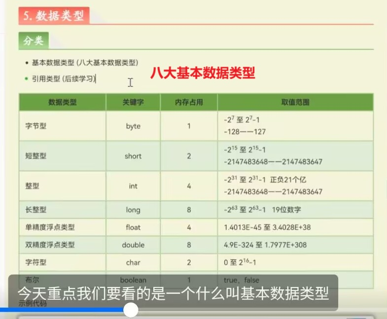
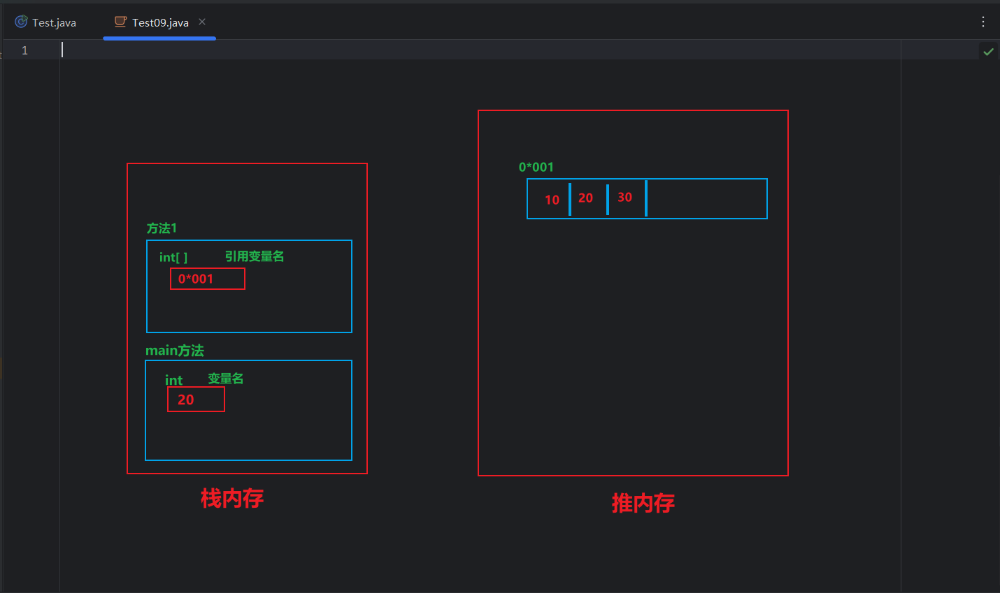

+++
date = '2025-12-03T11:22:11+08:00'
draft = false
weight = 3
title = '第二章_基础语法速览'
description = '-变量- -常量- -标识符- -关键字-'
+++

# 知识概念浏览
* 变量 ： 用于储存一个值的容器，
    > 数据类型<sup>对数据的*强限制*</sup>  变量名 = 数据值 ;

* 常量 ： 必须初始化，且存储的值无法改变
    > final  数据类型  变量名<sup>全大写命名</sup> = 数据值 ; 

###### final关键字的小拓展
> final 【类】-> 限制【类】不能被继承
> final 【方法】 -> 限制【方法】不能被重写 

* 关键字 ： 有特殊含义的 单词<sup>全小写</sup>

* 标识符 ； 自定义的 变量、包、文件 的名称
    > 组成--> 字母 | 数字 | _下划线 | $美元符
    > * 不能数字开头 
    
    > 命名法：  
        * 小驼峰命名法 -- {长单词} 变量名 | 方法名 xxxYyyZzz  
        * 大驼峰命名法 -- 类名 XxxYyyZzz  
        * 全大写命名 -- 常量 XXX_YYY_ZZZ  

* 数据类型：  
基本数据类型 *仅有8个*
        
 
    > ***初始化：***  
        * long num = 100L;  
        * float num = 3.14F; float精度为小数点后6位 | double后12位  

    > ***数据类型转换***  
        *自动转换 byte -> short -> int -> long -> float -> double  
        1. *自动转换，在表达式运算中:int / double,会得到一个double<sup>自动统一成高类型</sup>*  
        2. *自动转换，在表达式运算中：byte、short、char会自动转换成int类型   

        *强制转换 -->可能造成数据精度丢失

    引用数据类型 *数据类型不是基本数据类型，就是引用数据类型*  
    >  ***初始化：***    
        一定是在 堆内存<sup>查看[内存图](#内存图)原理</sup> 中开辟一个空间，存储数据后，给该空间一个地址   
    > * 初始化的两大要素  
    > 1. 地址变量  
    > 2. 通过new开辟的空间  
    > int[] x , int[] y ， x = y  
    > x = new方式 ， 这两种都是对x这个地址变量的改变<sup>赋值新的地址</sup>      
    > * 所谓的 `final 引用类型变量` 就是限制x无法改变地址值 ；  
    而通过地址访问并改变地址处存放的内容是允许的  
    > * 所有引用数据类型本质上都是对象    


***
* 运算：
    > * 自增自减：  
    > `a++ ` --> 先赋值 , 后自增
    > `++a ` --> 先自增 , 后赋值  

    > * 三目运算符：
    > `关系表达式 ? 表达式1 ：表达式2 ; `--> 判断为 true，返回表达式1   
    > **[表达式](#表达式)并非代码语句，如果想通过这个表达式赋值---使用`int max = a>b ? a : b`**

* 逻辑运算符:
    > `&` `|` `!` `&&` `||`  
    > `^` 逻辑异或<sup>求异</sup> -> 左右boolean返回值一致时，返回true 

* #### 表达式
    > * 一定要有返回值
    > 1. 算式表达式  --> 返回数值
    > 2. 逻辑表达式  --> 返回boolean值
    > 3. 简单表达式  --> 直接返回本身(例："陈雨轩"字符串，2数字之类的) 

* 流程控制语句
    > 1. 顺序结构<sup>默认的</sup>  
    语句从上到下执行

    > 2. 分支结构<sup>选择结构</sup>  
    if | switch 
    * `switch`
    ```java
        遇到`break`才会退出，不然一路穿透下去
        -------------------------------------------
        default:            ==       case (除去其他case情况的所有情况):          
            执行语句                       执行语句

        `default`没有`break`，所以可以放在任意位置，不影响switch的运行
        `default`可以不写                
    ```       
    > 循环结构 
    ```java  
        for(;;){} 是for形式的无限循环
        `数组命.fori` --> 遍历数组的简写
        `100.fori` --> ++循环for(int i=0;i<100;i++){}
        `100.forr` --> --循环for(int i=99;i>0;i--){}
        ---------------------------------------------
        打破 死循环 只能用`break`
        `continue`不能打破 死循环，只能跳出某一次循环执行，并不能跳出循环体
    ```

* 数组
    > 初始化：  
        1. 静态初始化 --> *元素明确*   
        **完整形式**  int[] a = new int[] {元素<sub>1</sub> , 元素<sub>2</sub>}  
        **简写**  int[] a = {元素<sub>1</sub> , 元素<sub>2</sub>}  
        2.动态初始化   
        int[] a = new int[数组长度] 数组长度*可以是变量<sup>有明确数值赋值</sup>  
        3. 等待空间开辟<sup>本质等价int a;未赋值状态</sup>  
        int[] a ;    
    * 数组名.length 数组对象的属性 -> 存储数组的长度 
    > 存储原理：  
    a ，数组名，是引用变量 `[I@数组的内存地址`   
    `[`表示数组  |  `I`表示Int类型   |  `@`表示分隔符   
    > **连续空间存储**，有索引值

* 方法
    > 创建 :   
    返回值 方法名(形参<sub>1</sub> , 形参<sub>2</sub>){ }  
    >` return ` 执行后函数退出函数，跳出函数代码块 , 函数默认执行`return ;`返回空值`null`   
    > `参数`  参数只是传入的数值  
        在函数中默认进行 `形参 = 实参` 的赋值操作    
        1. 传入基本数据类型 ： 形参 = 数值 ，对形参操作并不会影响到实参   
        2. 传入引用数据类型 ： 形参 = 地址 ，对形参操作会影响到数据本身，导致实参也受到影响  
    
    > 方法重载 ：参数同名不同参数，会被视为不同的方法


***
* 作用域逻辑
```java
class 类{
    int a = 10; //-> 全局变量,属于`class`类代码块，最外层的代码块
    方法1(){
        int b = 10； 
    }
    方法2(){
        if(){
            int c = 10;  // ->每次if被执行一次，c变量初始化一次
        }
        for(){
            int c = 10;  // -> 每次for循环体执行一次，c变量初始化一次
        }
    }
    --------------------------------
    作用域 的之间可以分为平行关系和包裹关系
    # 一个代码块，对应一个作用域。
    # 内层的作用域可以访问外层的变量（包裹关系）
    # `if`和`for`两个代码块的作用域里，都定义c变量不产生冲突。
    因为两个c只会在自己作用域中生效，也不能被外层的作用域访问(平行关系)
    # `方法1`和`方法2`(平行关系)
    是被`class类`作用域包裹的,不能在方法中重新定义a变量(包裹关系)
}
```    

* #### 内存图


* 栈空间：
1. 方法执行，先进后出[main](#main方法是什么)方法压箱底

* 堆空间：
1. 通过new方法创建，会在堆空间开辟一块空间，并给与对应的地址

##### main方法是什么？
是程序的启动入口<sup>唯一性</sup>  
* 整个程序的启动类必须要main方法 |
* 也可以通过main方法对一个类的各项功能进行测试 |