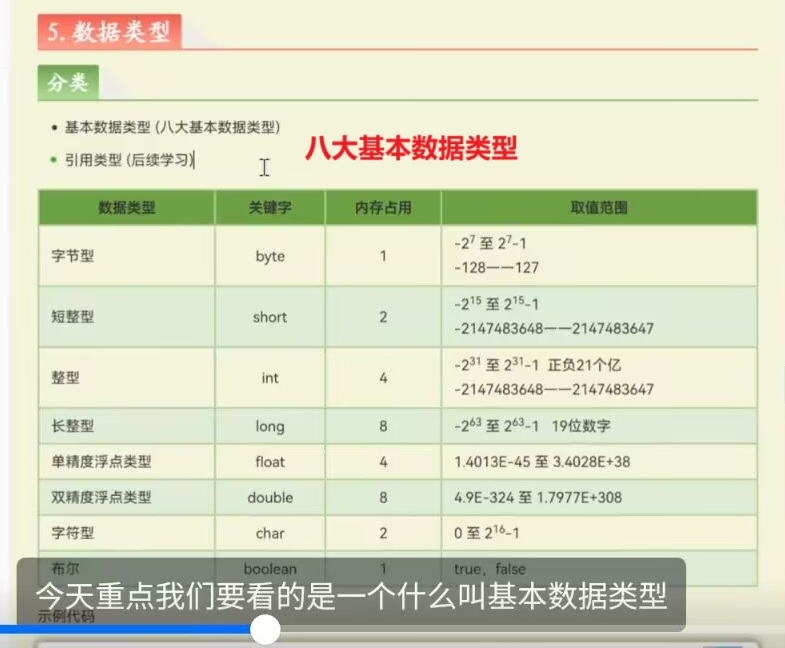
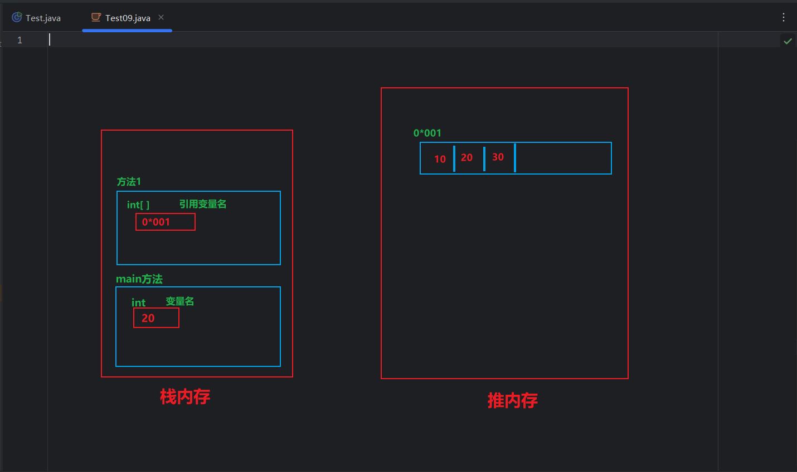

+++
date = '2025-12-03T11:22:11+08:00'
draft = false
weight = -47
title = '第二章_基础语法速览'
description = '笔记性质文章-聚焦前期的散点知识语法'
+++
**引言：**     
上一章中我们已经明确了，文件，是我们程序的重要载体，这节课我们主要就是学习具体的代码的语法  
要明确的一点，这些代码是写在文件里的，也就是说这些代码都是写在**类**中的


## 知识概念浏览
* **变量 ：**  用于储存一个值的容器，
    > 数据类型<sup>对数据的强限制</sup>  变量名 = 数据值 ;
    ```java
        int number = 100 ；
    ``` 

* **常量 ：** **必须初始化**，且存储的值无法改变
    > final  数据类型  变量名<sup>全大写命名</sup> = 数据值 ; 
    ```java
        final int NUMBER = 100 ；
    ```

变量与常量有一个要点：所处的位置


* final关键字的小拓展
    * final 【类】-> 限制【类】不能被继承  
        ```java
            public final class XxxYyy{

            }
        ```
    * final 【方法】 -> 限制【方法】不能被重写 
        ```java
            public final void xxxYyyZzz(){

            }
        ```

* **关键字 ：** 有特殊含义的 单词<sup>全小写</sup>  
关键字的**基本架构：**,也是一种书写的套路，要记！  

    ```java
    // 一个完整的文件结构如下:  

        package 包名称 ;
        //标志着文件所在的包
        import 包.类 ;
        // import 语句，显示这个类能调用的类
        public *final* class XxxYyy{
            public *static* *final* void xxxYyy( ) {
                *final* int number ;
            }
        }
        // * *包住表示关键字是非必须添加的
    ```

* **标识符 ；** 自定义的 变量、包、文件 的名称
    > 组成--> 字母 | 数字 | _下划线 | $美元符   
    > **不能以数字开头命名** 
    
    > 命名法：  
        **小驼峰命名法**  xxxYyyZzz   
        用于  变量名、方法名  
        **大驼峰命名法** XxxYyyZzz    
        用于  类名   
        接口 的命名是 IXxxYyy   
        **全大写命名** XXX_YYY_ZZZ  
        用于  常量      

* **数据类型：**  
分为两大组成部分（基本数据类型 --- 引用数据类型）：  
    * 基本数据类型 **仅有8个**
        
 
    > ***部分特殊的初始化：***  
        long num = 100L;  
        float num = 3.14F;   
        `float`精度为小数点后6位 | `double`后12位  

    > ***数据类型转换：***  
        **自动转换** byte -> short -> int -> long -> float -> double  
        自动转换规则要点：  
        -在表达式运算中: `int / double` , 会得到一个`double`<sup>**自动统一成高类型**</sup>    
        -在表达式运算中：byte、short、char会自动转换成`int`类型，其中，char的转换依据[【ASCII表】](#ascii表)   
        #强制转换 -->可能造成数据精度丢失  
        `int number = (int)(100.45) ;`

    * 引用数据类型   
    **数据类型不是基本数据类型，就是引用数据类型** ， 数组、对象 都是引用数据类型  
>  ***引用数据类型的初始化原理：***  



> 一定是通过new方法  
    在 【堆内存】<sup>**查看[**内存图**](#内存图)原理**</sup> 中开辟一个空间，  
    存储数据后，给该空间一个地址     


```java
    int[] array = new int [] {1,2,3};
// 数组的初始化
    Random rd = new Random( );
// 对象的初始化
    // 由此可见，引用数据类型的初始化可以分为两个部分
    // 左半边：数据类型 地址变量     右半边：new方法开辟的空间
    // 再由赋值的定义可得，这个过程是new方法开辟的空间，生成的地址  
    // 把地址赋值给地址变量array/rd，然后我们通过地址变量访问到这个空间
// 例如：
    int[] x = {1,2,3};
    int[] y = {1,2,3}; 
    // 此时，x和y的地址是不同的
    x = y  
    // 此时，x和y指向同一个地址
    x = new方式 
    // 这两种都是对x这个地址变量的改变，赋值新的地址。

    final int[] ARRAY = {1,2,3};
    final Random RD = new Random( );
    // 当final来限制地址变量为常量时，
    // 是限制了地址，也就是推内存中的空间不能再改变
    // 但是，数组的元素、对象的成员都是可以改变的
```

**关于引用数据类型的注意事项：**   

* 当变量地址是空指针（null），也就是没有地址的时候，我们不能打 印。打印会报错！   
**null** 是空指针，是一种数值，能赋值给**引用数据类型的变量** 

    * 所有引用数据类型本质上都是对象，   
    数组就是一种特殊的对象  
    例如，当我们打印**数组**的**地址变量**时，跟正常**没有重写toString方法类**的**对象**一样，都是默认使用 **地址变量名.toString( )** 方法  
    这个方法不重写的话，就是继承自**始祖类Object**,会返回**数据类型@地址**构成的字符串      


* **运算：**
    > * 自增自减：    
    > `a++ ` --> 先赋值 , 后自增  
    > `++a ` --> 先自增 , 后赋值  

    > * 三目运算符：   
    > `关系判断式 ? 表达式1 ：表达式2 ; `--> 如果判断为 true，返回表达式1   
    > 返回的也是**表达式**，  
    **表达式分为以下几种：**  
    > 1. 算式表达式  --> 返回数值
    > 2. 逻辑表达式  --> 返回boolean值
    > 3. 简单表达式  --> 数值本身(例："陈雨轩"字符串、数字2、boolean值true)   
    > 
    > 也就是说**三目运算符**肯定是有结果的，且结果是**表达式**   
    > * 利用三目运算式给变量赋值`int max = (1>2) ? (-1) : (100)` 
    


    > * 逻辑运算符:  
    > `&` `|` `!`    
    短路的`&&` `||`    
    > `^` 逻辑异或<sup>求异</sup> -> 如果左右boolean返回值一致，返回true 

    

* **流程控制语句**
    > 1. 顺序结构<sup>默认的</sup>  
    语句从上到下执行

    > 2. 分支结构<sup>选择结构</sup>  
    if | switch   
    如果我们要判断的可能是范围式的，例如 `a>100` 这样的，我们用**if**  
    如果我们要判断的可能是有限个的数值，例如 `switch(a)，a讨论的是星期` ，我们用**switch** 

    * **if:**

```java
    if(判断式){
        执行语句1 ；
    }else{
        执行语句2 ;
    }
// if-else结构，如果.....否则......
    if(判断式){
        执行语句1 ；
    }else if(判断式){
        执行语句2 ；
    }else{
        执行语句3 ；
    }
// if-esle if -else结构，从上往下，谁成立执行谁
// 一旦有一句被执行，整个结构结束。也就是说 执行语句123中只有一个能被执行 
    if(判断式){
        执行语句1 ；
    }if(判断式){
        执行语句2 ；
    }else{
        执行语句3 ；
    }
// if 与 if 之间都是独立的。else与最近的一个if构成if-else结构 
```

* **switch:**

```java
    //  switch语句具有穿透性
    //  也就是说整个switch遇到 break 才会退出，不然一路运行下去,也就是触法多个 case结构
    switch(a){
        // a这个变量必须是已经有确定的数值了
        case 1:
            // case 后面的必须是数值，即使是数值确定的变量都不行！
            // 数值后面的是`:`冒号
            执行语句1 ；
            break;
        case 10：
            执行语句2 ；
            break;  
        default :
            执行语句3 ；             
    }
    // default: 其实就是 case (除去其他case情况的所有情况):          
    // default: 没有`break`，所以可以放在任意位置，不影响switch的运行
    // default: 结构 可以不写,不写就不会有 case (除去其他case情况的所有情况):的判断了               
```  

> 3. 循环结构   
    while | for

* **while:**

```java
    while(判断式){
        执行语句 ；
    }
// 先判断条件，再执行语句
    do{
        执行语句 ；
    }while(判断式);
// 先执行一次，这一次是必然会执行的，再判断条件，
// 注意结尾while后面的`;`分号 
```    

* **for:**

```java  
    for (int i = 0; i < 100; i++) {
        执行语句 ；
    }
// `100.fori` 简写++循环

    int[] array = {1,2,3};
    for (int i = 0; i < array.length; i++) {
        执行语句
    }
// `数组名.fori` --> ++型遍历数组的简写，

    // 数值.forr ->  是--型的简写

    for(;;){
        执行语句
    }
// 这是for形式的死循环
```
打破**死循环**  
只能用`break`   
`continue`不能打破**死循环**， 
只能跳出某一次正在执行的循环，并不能跳出循环体


* **细致的讲解数组：**
    > **初始化的三种情况：**  
        1. 静态初始化 --> **元素明确**   
        **完整形式**  int[] a = new int[] {元素<sub>1</sub> , 元素<sub>2</sub>} ；  
        **简写**  int[] a = {元素<sub>1</sub> , 元素<sub>2</sub>} ；  
        2.动态初始化  --> **数组长度可以是数值、已经有明确数值的变量**  
        int[] a = new int[数组长度] ；  
        3. 等待空间开辟 --> **未赋值状态,此时a指向空指针，打印会报错**  
        int[] a ;  

    * **数组名.length** 数组这个对象的属性 -> 这个属性的值就是数组的长度 
    > **存储原理：**  
    a ，数组名，是地址变量  
    a.toString( ) -> `[I@数组的内存地址`   
    `[`表示数组  |  `I`表示Int类型   |  `@`表示分隔符   
    > **连续空间存储**，有索引值

* **方法**
    > **创建方法声明 :** 
```java
    返回值 xxxYyy(形参1 , 形参2){ 
        // `实参` 是传入的 数值；`形参`是方法中的变量  
        // 在函数中默认进行 `形参 = 实参` 的赋值操作    
        // 1. 传入基本数据类型的数据 ： 形参 = 数值 ，对形参操作并不会影响到实参   
        // 2. 传入引用数据类型的数据 ： 形参 = 地址 ，对形参操作会影响到数据本身，导致实参也受到影响  
// 所以我们要注意，方法对引用类型数据，也就是数组、实例的影响是直接改变它本身的 
        // 执行语句 ；
        return ;
        // 方法一定有 返回值 ，一定有return结构，二者相对存在 
        // return ; 是默认的，你不写返回值时，系统会帮你写
        // return ; 对应的返回值声明是 void ,就是什么都不返回
// 注意一点，return null ; 是返回 空指针 ，它对应的返回值声明是 引用数据类型 
    }
```          
    
* **方法重载 ：**  
一个类中方法是不能出现重复的  
当两个方法的**方法名**是一致的时候，无论返回值是不是同类型，这两个方法都是同一个    
但是，在此时，如果**形参**不同，这两个方法会被视为不同的方法，也就是**方法重载**   
而**形参不同的判断标准** 是依据形参类型的**种类和数量**，   
只要两个方法的**类型种类或者数量不一致**，这就是重载  

* **main方法是什么？** 
```java
    public static void main(String[] args) {
        
    }
``` 
是程序的启动入口，**具有唯一性**    
整个程序的启动类必须要main方法，我们只在启动类中写main方法    
也可以通过main方法对一个类的各项功能进行测试 


***

上面的内容已经包含了各式各样的语法点了，  
现在我们讲一些贯穿在这些语法点各处的**语法要素**

* **作用域逻辑**  
**变量**在整个**类不同的位置中**，作用的范围是不同的
```java
class 类{
    int a = 10; //-> 全局变量,属于`class`类代码块，最外层的代码块
    // 类的成员属性
    方法1(){
        int b = 10； 
    }
    方法2(){
        if(){
            int c = 10;  // ->每次if被执行一次，c变量初始化一次
        }
        for(){
            int c = 10;  // -> 每次for循环体执行一次，c变量初始化一次
        }
// `if`和`for`两个代码块的作用域里，都定义 c变量 不产生冲突。
// 因为两个c只会在自己作用域中生效，不能彼此访问(平行关系)
    }
    --------------------------------
    作用域 的之间可以分为平行关系和包裹关系
    # 一个代码块，对应一个作用域。
      for结构、if结构、整个类class结构。具有{执行语句}这样的代码体，那他就是一个作用域

    # 内层的作用域可以访问外层的变量（包裹关系），
      也就是说外层的变量会作用到里层，里层的不能作用到外层

    # `方法1`和`方法2`(平行关系)
    是被`class类`作用域包裹的,不能在方法中重新定义a变量(包裹关系)
}
```    

* **再讲内存图**    
内存图反应了整个程序运行时，代码执行的逻辑

当一个类被执行时

* **栈空间：**   
存放**方法**，方法先进后出，**main方法**压箱底

* **堆空间：**  
当有地方使用**new方法**，就会在堆空间开辟一块空间，并给与对应的地址


* **ASCII表**  
数字与字符对应 a-z : 97-122 | A-Z : 65-90