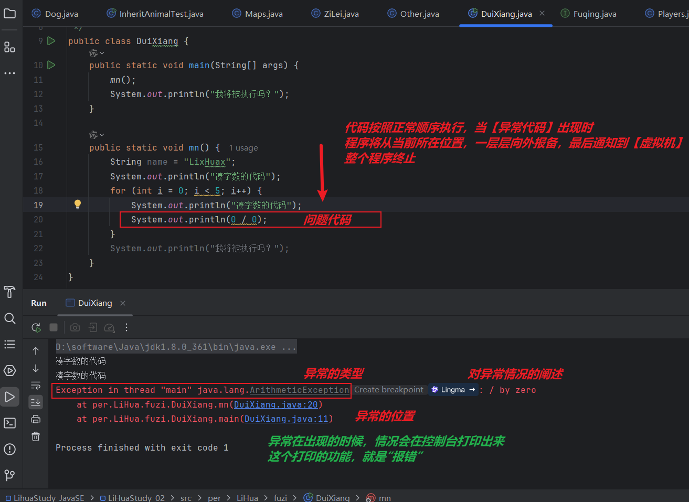
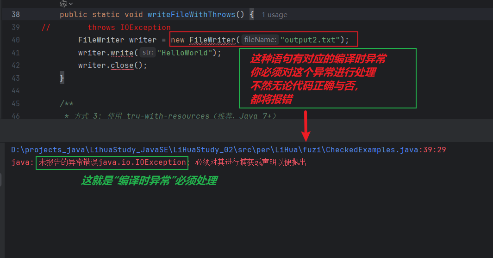
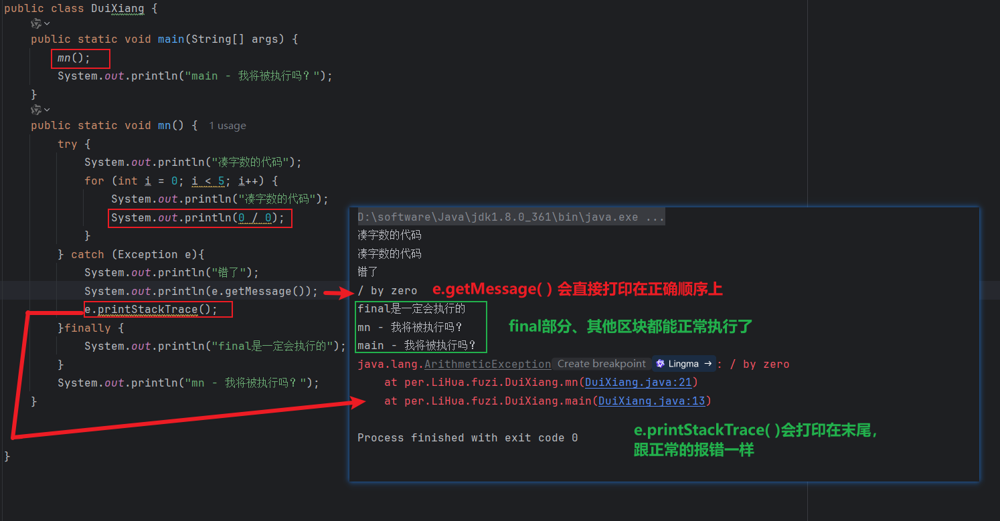

+++
date = '2025-12-16T23:37:20+08:00'
draft = false
weight = 7
title = '第六章_异常'
description = '笔记性质文章-学习异常的处理方法'
+++
**引言：**     
异常在一个程序运行时会出现，当用户在使用我们的程序时也难免触发异常。  
那我们就要做到一个**对异常的预测**在我们觉得会出现异常的地方进行一个**捕获和解决**    
这种思想我们之前在**用户输入框架**中就有体现，我们为了防止伪人客户错误的输入，就提前把错误情况预测了，并解决了。现在的异常也是这个思维，但是方法不同

## 异常
**java已经为我们提供的异常类的家族谱：**  
【Throwable】异常类的顶级父类  
他的子类    
【Error】，我们暂时不学习   
【Exception】，是我要学习的异常的始祖类

【Exception】的子类     
【RuntimeException】是运行时异常

* 【Error】、【RuntimeException】类及其子类，**编译时**不会报错，**运行时**才会报错  

   


* 【其他异常类】，在**编译时**就会爆红，出于善意提示你做处理，   
这种**编译时**的报错，是**强制**你对**可能出现**该异常的语句做处理，  
这个代码**可能出现**这一类的异常，如果你不做处理，一定会报错 



***

**异常的处理方法**   
当异常出现时，**虚拟机**将会停止工作   
为了防止这个情况的出现，我们对异常进行处理

* **异常的捕获：**   
异常是一定要捕获的，  
捕获就是**在如果出现异常时，我们该怎么执行代码，保证程序的正常运行**  
不管怎样通过【throw】对异常进行堆积，最后一定要**把所有异常捕获**，才能保证**虚拟机能运行程序**

```java
    public static void xxxYyy() {
        执行语句 0；

        try{
            执行语句1 ；
            执行语句2 ；
            // 【try】包住可能会出现异常的代码
            // 如果【执行语句2】出现异常，【执行语句3】将不会执行，直接跳转到对应的【catch】，并执行里面的代码
            执行语句3
            // 由于【执行语句2】出现异常，【执行语句3】将不会执行
            // 所以只有 一个【catch】 会被触发

        }catch (异常类1 e){
            执行语句 ；
            // 我们一般会在这里 把异常写入日志
            e.printStackTrace(); -> 打印异常具体信息
            e.getMessage().sout -> 打印异常的类型
        }catch(异常类2 e){
            执行语句 ；
            // 如果【try】出现【异常类2】，就会创建一个这种【异常】的对象e，并执行语句
            // 你可以把【try】可能出现的异常类都写出来，这样可以精确的捕获对应的类型
        }catch(Exception e){
            // 用父类Exception进行兜底，保证出现任意类型都能被捕获
        }finally{
            执行语句 ；
            // 在【try-catch】之后执行，无论【try-catch】结构是否有异常，【finally】都会执行
            //我们一般在这里释放在【try-catch】结构中被占用的资源
        }

        执行语句 4；
    }
```



* **异常的抛出：**   
异常是可以抛出的，抛出这个方法，抛到**调用这个方法**的其他方法那里  
最后可以抛到**main方法**，  
到这里时，所有异常必须已经都被**捕获**了或者**在main方法中被捕获**，因为再往上就要到**虚拟机**了
```java
        public static void xxxYyy() throws 异常类1 ，异常类2{
// 抛出异常的 方法声明 可以加上【throws 异常类】 来表明这是一个存在异常的方法 
        执行语句 0；

        try{
            执行语句1 ；
            执行语句2 ；
// 假定【执行语句2】出现异常，是【异常类1】，触发了【catch (异常类1 e)】
            执行语句3

        }catch (异常类1 e){
            执行语句 ；
            // 我们一般会在这里 把异常写入日志
            e.printStackTrace(); -> 打印异常具体信息
            e.getMessage().sout -> 打印异常的类型
// 【抛出】也是在【try - catch - finally】框架中 ，
// 在【catch】已经创建出【对象】时【throw e】抛出
            throw e ；
// 一旦选择用抛出异常，这个一整个【方法体】就被终止了，【执行语句4】不能再执行了 
        }catch(异常类2 e){
            执行语句 ；
        }catch(Exception e){
            执行语句 ；
        }finally{
            执行语句 ；
//  即使【抛出异常】了，【finally】还是会执行 
        }

        执行语句 4；
// xxxYyy方法已终止， 【执行语句4】不能再执行了 
    }
```

【抛出异常】和【捕获】都是基于【try - catch - finally】的   
这个框架用`选中目标代码 + ctrl + alt` -> 快捷键搭建


**学会自己写异常类**  
```java
    public class LiHuaException extends RuntimeException{
        // 自定义的异常类必须继承自Exception
        public LiHuaException(String Message){
            //    创建构造器,有参数【Message】，就是报错信息
            super(Message);
        }
}
```

**异常类**创建好之后，你还要设计**某种情况**会被认定是这个异常，也就是**什么时候会异常**   
必须在程序中用【if】框架实现一次【throw 自定义异常的对象】

```java         
    public class XxxYyy{
        public void func_00 (){
            try{
                func_01();
            }catch(LiHuaException e){
                e.printStakeTrace() ;
                throw e ;
            }    
        }

        public void func_01 ( ) throws LiHuaException{   
            int xxxYyy;
            if(xxxYyy > 10){
                throw new LiHuaException("xxxYyy不应该大于10 ！");
        }
    }
```


**提笔：**   
我们说过    
我们本章节就是要做到一个**对异常的预测**，在我们觉得会出现异常的地方进行一个**捕获和解决**    
这种思想我们之前在**用户输入框架**中就有体现，我们为了防止伪人客户错误的输入，就提前把错误情况预测了，并解决了。当时用的是【while(true)死循环】卡死用户，让他一直输入         
而现在【自定义异常】则是终止**用户输入**这一行为。    
因为**异常**最后肯定会被**捕获**，并在【catch】中告诉你错误的具体信息，不会再让你输入了
